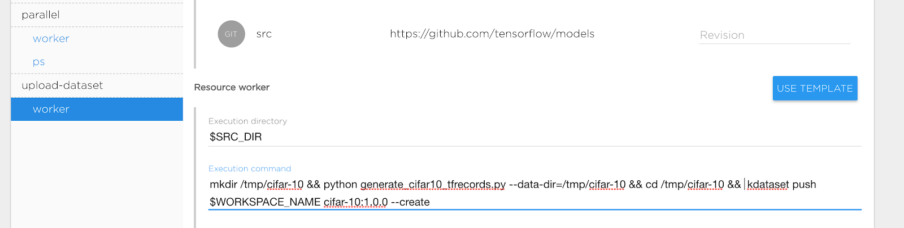
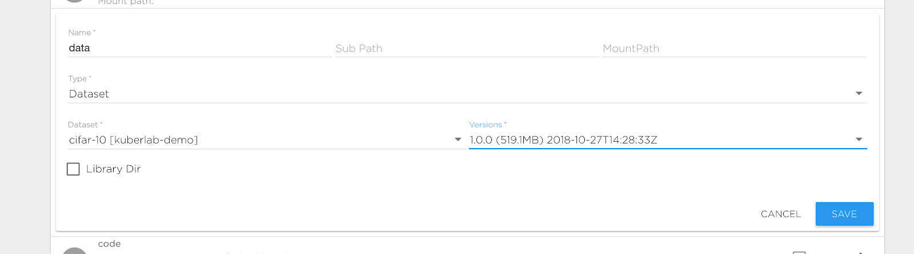

# Tran CIFAR-10 Model from scratch using Kibernetika.AI

This tutorial shows basic steps required for train CIFAR-10 model using original source code from https://github.com/tensorflow/models/tutorials/image/cifar10_estimator

### Install Tensorflow project

- Start creating new project in your Workspace. [More details](/Projects/Create New Project/) 
- Set Tensoflow version 1.9.0
- Set source location to __https://github.com/tensorflow/models/tutorials/image/cifar10_estimator__ in this case __https://github.com/tensorflow/models__ will be used as Source repository and __models/tutorials/image/cifar10_estimator__ as subpath. Contents of __https://github.com/tensorflow/models/tutorials/image/cifar10_estimator__ will be visible inside Jupyter or running Job under $SRC_DIR path, usually SRC_DIR is alias for __/norebooks/src__

### Prepare Dataset

First we need upload CIFAR-10 to Kibernetika. There are two options to upload data. 

- Upload data to  some project directory for example to $DATA_DIR.
- Upload data to Kibernetika DataSet Catalog.

Second one is preferable it will allow you have versions for your dataset, use dataset in other projects. 

Following steps required to upload dataset to catalog:

- Create new task __upload-dataset__ inside project for upload dataset, by cloning existing on or creating new one form scratch.
- After creating task we are ready to define execution command for uploading. CIFAR-10 project already has code for uploading. Our task definition looks like: 


Basically we defined following parameters:

- Execution Directory: $SRC_DIR refer to location our CIFAR-10 source code
- Execution Command: 
>
```mkdir /tmp/cifar-10 && python generate_cifar10_tfrecords.py --data-dir=/tmp/cifar-10 && cd /tmp/cifar-10 &&  kdataset push $WORKSPACE_NAME cifar-10:1.0.0 --create ```

During running out new task following steps will be executed:

- Make temporary directory __/tmp/cifar-10__
- Use __generate_cifar10_tfrecords.py__ to upload dataset to __/tmp/cifar-10__
- Change current directory __/tmp/cifar-10__
- Push __cifar-10__ dataset to current workspace($WORKSPACE_NAME) DataSet catalog as version 1.0.0. __Create__ option  means create dataset if it doesn’t exist.


> _NOTES:_

> * _kdataset command is always present in Kibernetika environment_
> * _you also could push dataset to catalog directly from python script:_

```
from mlboardclient.api import client
mlboard = client.Client()
mlboard.datasets.push(
  os.environ.get('WORKSPACE_NAME'),
  'cifar-10',
  '1.0.0',
  '/tmp/cifar-10',
  create=True
)
```

After execution _upload-dataset_  we can refer our __data__ directory to created dataset. Change definition __data__ volume in the __Sources__ tab  to point it to new created dataset:


### Standard Train model

For start training model we need configure __Standalone__ task worker to train model.

* Set execution directory to $SRC_DIR
* Set execution command to python cifar10_main.py --num-gpus=$GPU_COUNT --train-steps=1000  --data-dir=$DATA_DIR --job-dir=$TRAINING_DIR/$BUILD_ID

> _Notes:_

> * $TRAINING_DIR is alias for preconfigured training directory, see __Sources__ tab
> * $BUILD_ID  is alias for secuntial job id, every running job has unique id
> * $GPU_COUNT is alias for number GPU allocated for execution on one compute node
> * Set required GPU count in the __Resources__ section
> * Start task

Now you can see execution logs in the __Jons__ tab, use __Tensorboard__ to see you training progress. Result of training model is available under training directory _$TRAINING_DIR/$BUILD_ID (usually  /notebooks/training/1,2….)_

### Distributed training
> __ATTENTION:__ CIFAR-10 Tensorflow original model is based on tf.contrib.learn witch was deprecated since Tensorflow 1.7 and distributed configuration is not compatible with newer tensorflow version. We recommend migrate you code to Tensorflow Estimators. In the Kibernetika you can use distributed training for both old and new style model, see details below.

First of all we need define resources that will be used for distributed training, e.g. workers and parameter servers.

* Change __Parallel/worker__ execution command to  ```TF_CONFIG=$(tf_conf worker --chief_name master) python cifar10_main.py --num-gpus=$GPU_COUNT --train-steps=1000  --data-dir=$DATA_DIR --job-dir=$TRAINING_DIR/$BUILD_ID --sync```
* Set __Parallel/Worker__ Replicas Count to 2 or more
* Set __Parallel/Worker__ GPU count to 1
* Change __Parallel/ps__ execution command to  ```TF_CONFIG=$(tf_conf ps --chief_name master) python cifar10_main.py --job-dir=$TRAINING_DIR/$BUILD_ID```

Now we are ready to start distributed training. During execution following process will be started:

* Two workers, on of them is chief
* One Parameter server

>__NOTE:__

> * Remove __--sync__ options for asynchronous training, see Tensorflow documentation for more details.
> * __tf_conf__ command is always present in Kibernetika environment 

### Usage of __tf_conf__ command
__tf_conf__ is basic script that help define environment for Tensorflow distributed training.


```
usage: tf_conf [-h] [--worker WORKER] [--ps PS] {worker,ps,eval} [--chief_name CHIEF_NAME]

positional arguments:
  {worker,ps,eval}  Set executable role

optional arguments:
  -h, --help               show this help message and exit
  --worker WORKER          Worker resource name
  --ps PS                  PS server resource name
  --chief_name CHIEF_NAME  Name for chief worker. 'chief' for newer Tensorflow version and 'master' for tf.contrib.learn
```

Also you could setup distributed configuration directly in your code:
```
from mlboardclient import utils
conf = utils.setup_tf_distributed(mode, worker_names='worker', ps_names='ps',chief_name='cheif')
os.environ['TF_CONFIG'] = conf
```

> __NOTES:__

> * Please see __link__ for more low levels details about distributed training on the Kibernetika platform.
> * Please see __horovod__ for using __Horovod__ and __OpenMPI__ for distributed training  

