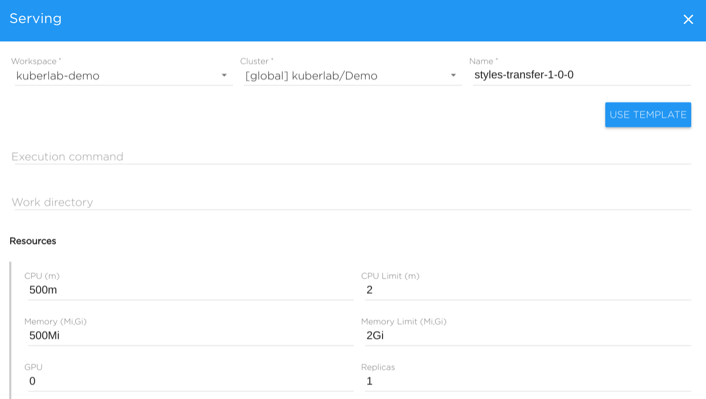
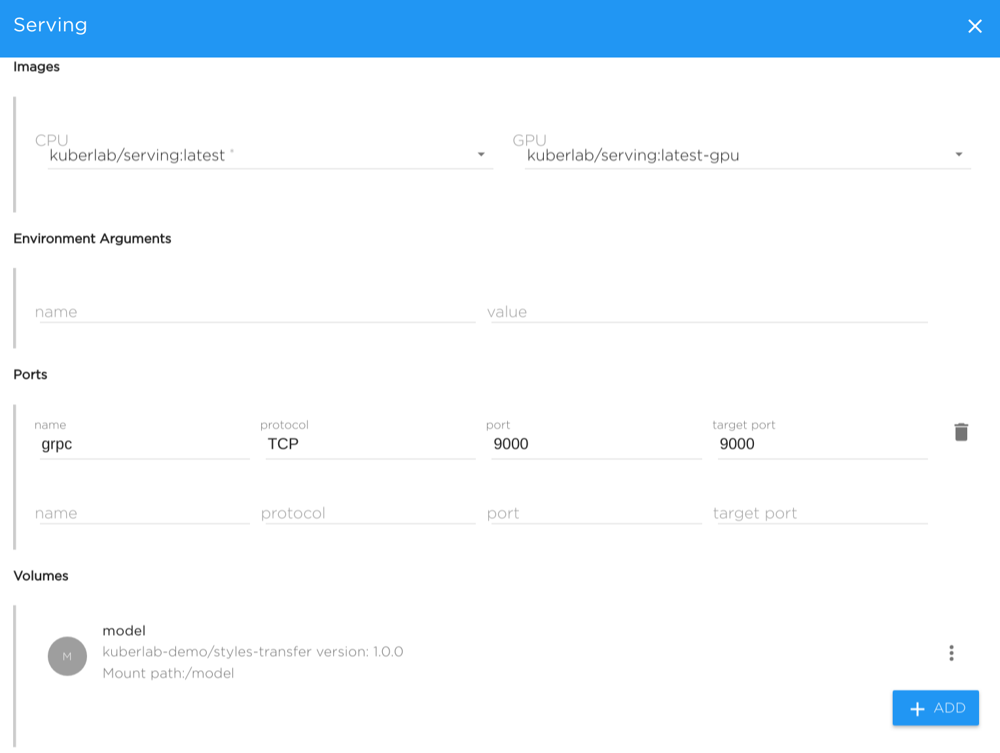
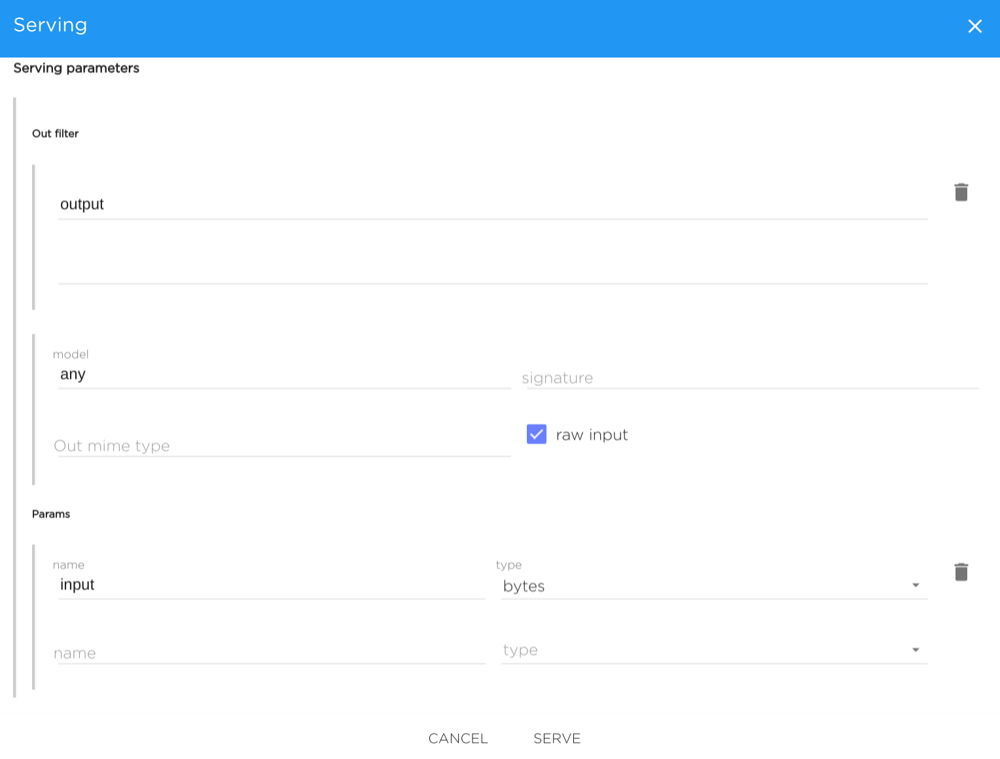

## Model Serving

Once you have created a model and pushed it to the catalog, you will
see the new model version on the **Versions** tab on the model view:

Now you are ready to serve the model.

Serving the model means that there will be a running TCP/HTTP server
which accepts incoming requests with data in the appropriate format,
runs inference with this data and give the output as the response.

To serve the model, click the **Serve** button near appropriate version.
You will see the serving configuration form which basically specifies
execution command, environment, data and resources for the serving object.

Let's see all the parameters in details.

Workspace
Cluster
Name
Execution command

**Note:** For the **kuberlab-serving** tool description and details, see
[here](kuberlab_serving.md).

Work Directory

Resources:
* CPU
* CPU limit
* Memory
* Memory limit
* GPU
* Replicas

Images
* CPU
* GPU

Environment variables
Ports

Volumes

Serving parameters

Output filter

Model
Signature
Output MIME Type
Raw input

Params
Name/Type