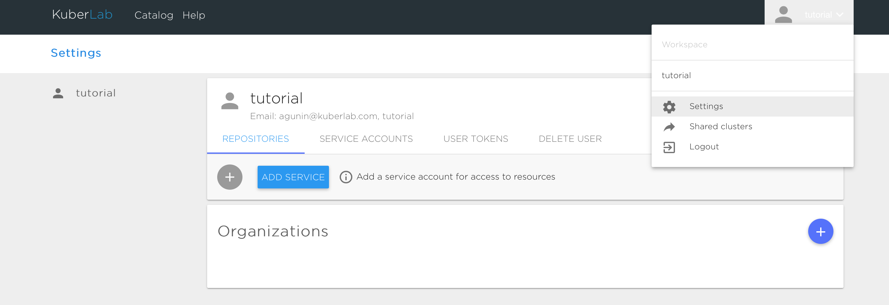

# User settings
To change personal info or configure access to external repositories and service account go to settings page.

#  Repositories
You can add  OAuth based connection to your external git repositories or to your google account. This is required if you are planning to create your own clusters or want to use user friendly dialog to connect git repositories to [project sources](/Projects/Work With Project.md#git-data-source).
Following OAuth connections is supported:

* [Github](https://github.com)
* [BitBucket](https://bitbucket.org)
* [Google Cloud](https://cloud.google.com)

# Service Accounts
Used for manage private information such as secrets,keys or password for external resources.

You could add following Service accounts:

* Google - OAuth credentials. Required for creating and provisioning your own [clusters](/Resources/Cluster.md) on the Google cloud.
* Amazon - AWS access ID and secret key. Required for creating and provisioning your own [clusters](/Resources/Cluster.md) on the AWS or to connecting [AWS S3 Bucket as data source](/Projects/Work With Project.md#s3-data-source) to your project.
* GIT - Private deploy key or user name and access token. Required for connecting private git repositories as data source to your project. See [Git data source](/Projects/Work With Project.md#git-data-source) for details and [using deploy keys](https://developer.github.com/v3/guides/managing-deploy-keys/#deploy-keys) or using [access token](https://help.github.com/articles/creating-a-personal-access-token-for-the-command-line/) 

# Billing
<mark>ATTENTION:</mark> May be not available for your account.

# User Token
You can create a personal access token and use it in place of a password for Kuberlab API or for CLI tools.

# Delete user
<mark>ATTENTION:</mark>Be careful, all your data will be lost after this action!