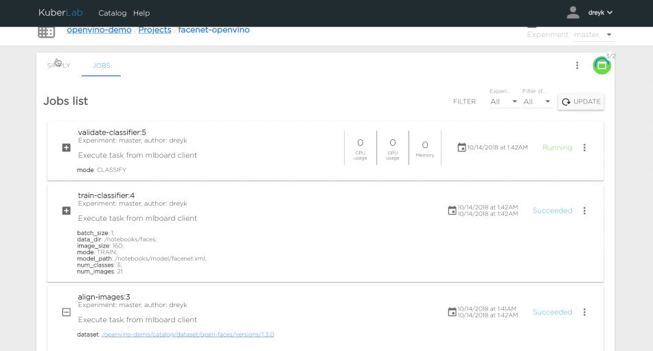

This tutorial is a walk through an end-to-end AI project creating a face detection and recognition application in the kibernetika.ai platform. We will begin by selecting data sets creating a project and selecting models, setting up the infrastructure, training those models, and completing by re-training for future proofing. 

Before we begin, let’s first address that there are two main steps to this project - face detection and face recognition. First, to detect that A face actually exists in the image and, second, to then recognize a specific face. Face detection includes Pnet, Rnet, and ONet neural nets to define face boundary boxes on a picture.

Face recognition includes calculating face embeddings using Inception ResNet model and training SVM classifier.

Start by creating a new dataset. In Kibernetika platform, we can do this using Web UI, CLI client or provided API. We will use Web UI.

Open catalog page in the workspace you are planning to work. It can be your personal workspace or organization workspace where you can invite other users to collaborate.

In the catalog go to Datasets and create the new dataset. Let's name it open-faces.

From the very beginning, we start by defining versions so we will be able to have better control throughout the life of this project. 

Select VERSIONS Tab and add the new version. You need to enter version in the x.x.x format. 

We then upload images of faces of the people we want to recognise, to the dataset. Creating folder for each person and adding the files to respective folders. 

It’s required to have at least 5 pictures per person, also it will be great if those pictures are different poses, etc...

We then create a new folder for pictures of another person, Nikolay, and upload those relevant files.

For the last set of data, let's name the folder "Other" and upload some random pictures of different people to better train the system.

The final step for prepping the data is to go ahead and commit it. 

Once we have this data set, we can go ahead and create a project. 

We will select the Kiberntika template for the pretrained tensorflow facenet model. You can view more info about this model or the many others included in the platform by viewing our github repository.  

Install the project by setting all required parameters and defining where the training data will reside by selecting the dataset which we previously created.

The project is now available to use. However, because the project is in Tensorflow format, we need to convert all models to openvino format, we use openvino as the inference backend engine in that project.

Next, we are going to execute our script to convert tensorflow models to openvino format. You can view this job in realtime to track progress.

The model is converted with the new files now existing in the kibernetika catalog. 

From here, we will switch over to use the generated openvino model. 

Now, go to the SOURCES tab of the project, and edit the content of the "model" volume

Change it to the model converted to OpenVINO

This brings us to the next part of the project, when we can actually start to train the face recognition model. This includes 3 sub tasks that we cluster together into pipeline task - Align images, train SVM model, and validate results.

Align performs cropping and will create a new version of the dataset that contains only cropped images.

The next task is to train SVM classifier using  Inception ResNet and openvino inference engine.

And the last task is validating the result and uploading the new model to model catalog. At this time, we generate a confusion matrix (confusion matrix keras) after the model validation to understand how accurate our new model is. 

After the model is built, we can start the inference portion of this project. 
Open facenet-classifier model and the version which you just build from your project catalog.  

For “Serving”, there are many parameters that we can define. We are setting OpenVino as a driver for the kibernetika.ai inference engine, filling required resources for inference, 

and docker images that will be used. 

Finally, we select a repository that contains additional business logic, for preprocessing and post processing model inputs and outputs.

Now that everything is in place, we can start serving. 

Once completed, we can easily test the face detection and recognition service.

Since data is likely to change over time in the real world, we can easily extend out the original dataset and continuously retrain the model. We call this Continuous Production and is a core funcion of the Kibernetika platform. Simply set up a new version, 1.0.1, add another person, Alex, and some images for that person. Reopen the project, switch the dataset to the new version and rebuild the model.

Again, once re-training and validation completed, you can see the model accuracy and then make informed decisions about deploying the new model to production. 

And, as a collaborative platform, you can easily share results, models, data, etc. with team members for a seamless rollout.

For more information on how you can accelerate your AI project with kibernetika.ai, reach us at info@kibernetika.ai today! 

