### Overview

Data is the reason why analytics exists, and why we do machine learning. Without data, there is no need for any deep learning models. Since models exist only for processing and analyzing the data, the following observations about the data are true:

Data needs to be validated and secure. Without this, the results of models could be invalid, or worse, even malicious.

Model training is extremely time-consuming, since it happens with large amounts of data. If the data is properly pre-processed, this operation can significantly speed up the model training and increase the accuracy of the resulting model.

Data changes constantly, which means that the model will need to be re-trained regularly on a different version of the data set.

To generate repeatable results in model prediction, the operation needs to be done with the same data set.

To use the Dataset object in the **Kibernetika** project, a user needs to add ***Dataset*** as a source in the project, and it will become available to the Jupyter Notebook as well as the Python or R execution environments.

### Create dataset

Dataset can be created from UI interface directly or using [kdataset CLI](../tools/kdataset.md). For creating new dataset from UI  go to catalog in any organization, choose "Dataset" section in the left menu and click "(+) Add" button. Fill required field Name, Idenfification will be filled automatically if empty. Optional Description and Keywords also can be filled. "Published" checkbox should be checked if user wants his dataset will be available for all users.

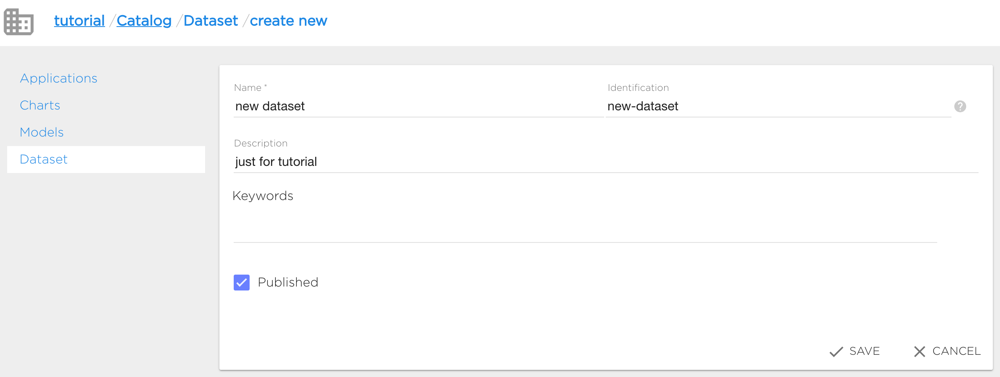

New dataset will be created after clicking "Save".

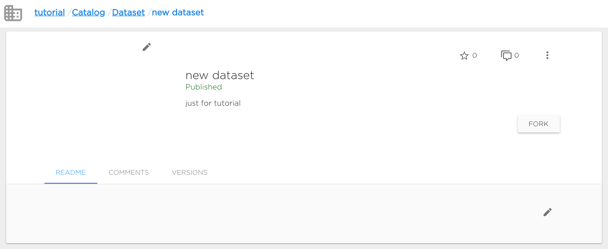

Dataset as all other catalog objects can be marked with star and commented by all users who have access to this dataset.
Dataset's owner can edit readme (Readme tab) and manage dataset versions (Versions tab).

### Update dataset metadata

Dataset metadata info can be updated only in UI.

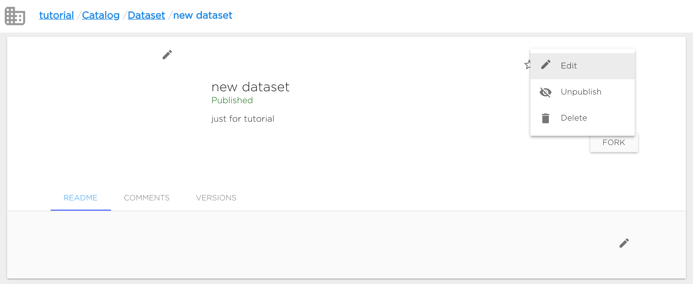

"Edit" option is available in dataset's context menu. User can change dataset's Name, Desctiption and Keywords. Identification can not be changed.

User can change dataset's visibility option (Publish/Unpublish option): make dataset published (available for all users) or not (available only for users who can manage datasets in current organization).

Also user can change dataset's picture.

### Fork dataset

User can use in his projects all dataset from the same with the project organization and **only published datasets from other organizations** despite the dataset can be available for user.
So if user wants to use private dataset from another organization, he can fork this dataset to project's organization.

Fork action makes dataset copy in target organization with the same name. So before forking user should ensure that there's no dataset with the same name in target organization.
Also user should ensure that he can manage datasets in target organization.
Fork copies **only commited dataset versions**.

User can fork dataset by clicking "Fork" button and choosing target organization.

### Delete dataset

Dataset can be deleted both from UI (context menu "Delete") or using [kdataset CLI](../tools/kdataset.md).

### Dataset versions

All datasets are versioned. So user can create, clone and delete dataset's versions and manage version's files.

### Create new dataset version

Dataset version can be added in UI. User should go to "Versions" tab and click "+ New Version" button.

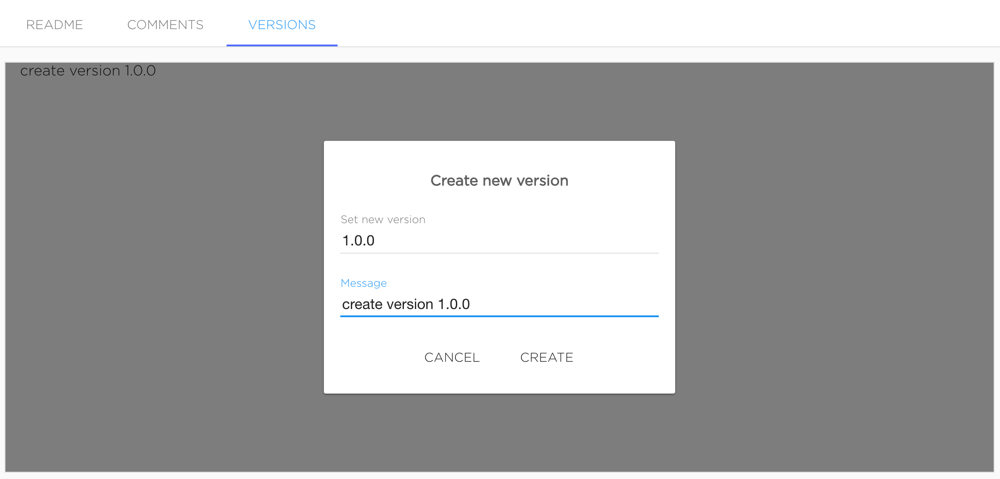

Version name should be semantic versions. Message is optional.

Versions will be added after clicking "Create".

Also dataset version can be added with [kdataset tool](../tools/kdataset.md).

### Manage dataset version files

Just created dataset's version marked as Editing, it means that user can change version's contents.

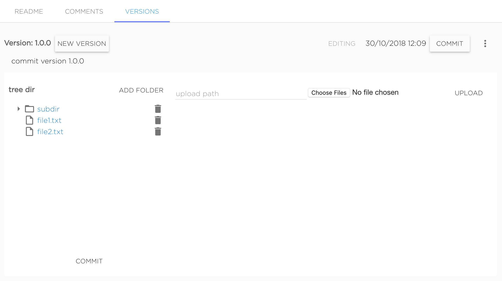

User can upload new files and delete existing ones. To upload file to subdirectory it needs to set required upload path to "upload path" field. Files are uploading with the same names as original files. For example, to upload file `my-file.txt` to dataset's version to directory `dir/subdir` user should upload file named `my-file.txt` with typing `dir/subdir` in "upload path" field, final uploaded file will have path `dir/subdir/my-file.txt`. Not existing directories will be create automatically.

To delete file or directory user should click to bucket icon near object he wants to delete.

When dataset version editing is finished user should commit version by clicking button "Commit".

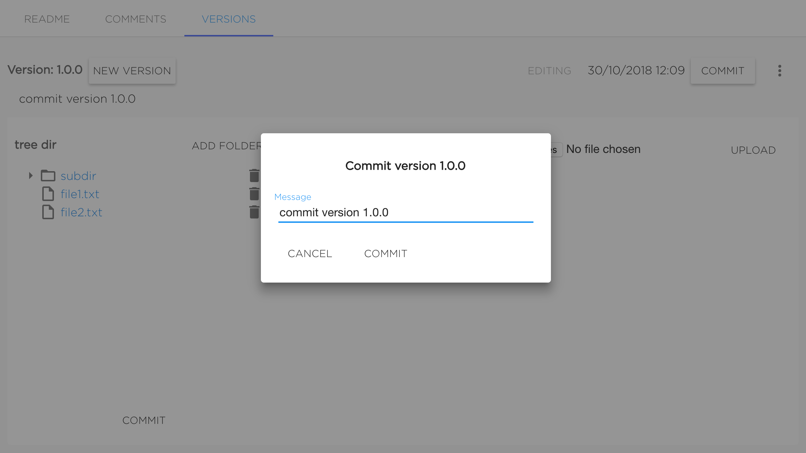

Version will be commited after setting the message (it's not required to change it) and confirming commit by clicking "Commit".

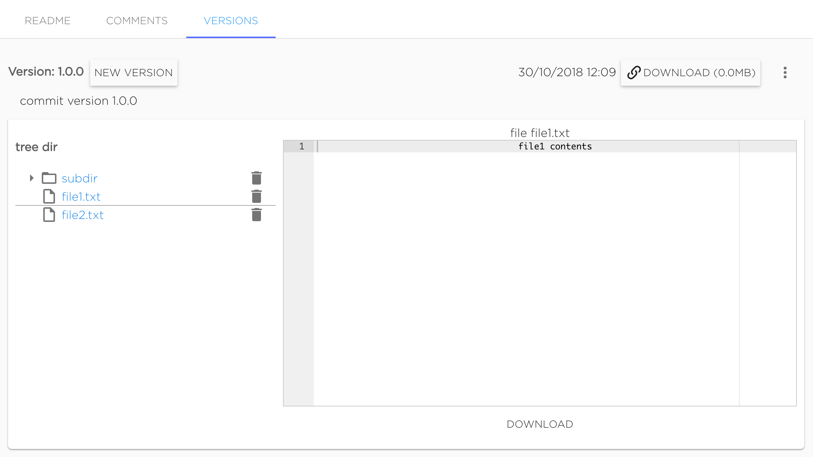

Commited version can not be changed. Only commited versions can be mounted to projects. User can preview files of commited version in UI.

Also commited version can be downloaded as archive.

### Clone version

Existing version can be cloned as new editing one by clicking button "New version" near existing version's name.

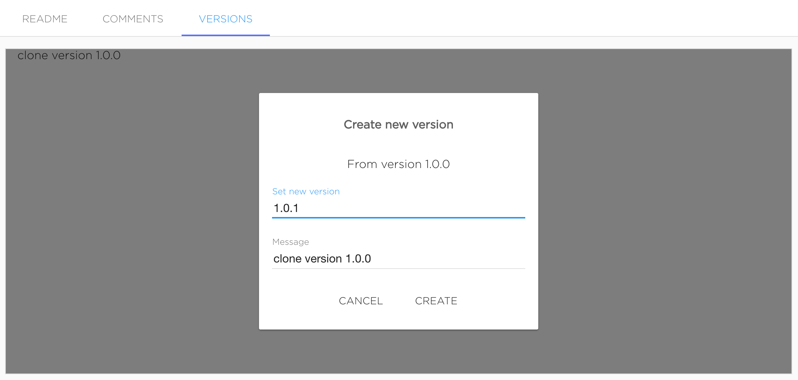

This action looks like creating new version, but cloned version will have all files from source version.

### Use datasets inside project

To use the Dataset object in the **Kibernetika** project, a user needs to add ***Dataset*** as a source in the project, and it will become available to the Jupyter Notebook as well as the Python or R execution environments.

To configure this, select the storage type ‘dataset’, and choose the required dataset and version from the list displayed (see figure below).

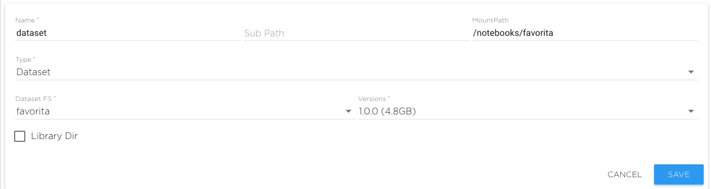

Now you can see the data set as a folder in Jupyter Notebook. In workflow tasks it will be accessible by the use of environment variables.

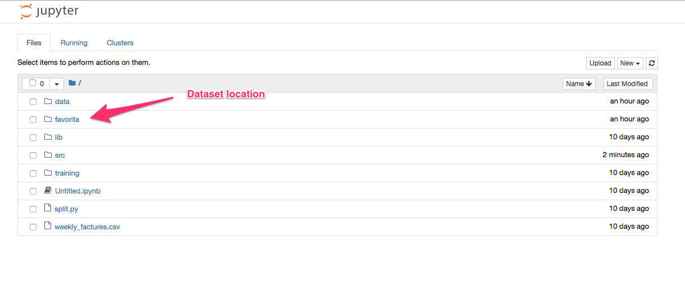

Both the Jupyter Notebook, and the Python and R environments can access the data files stored in the data set directories chosen.

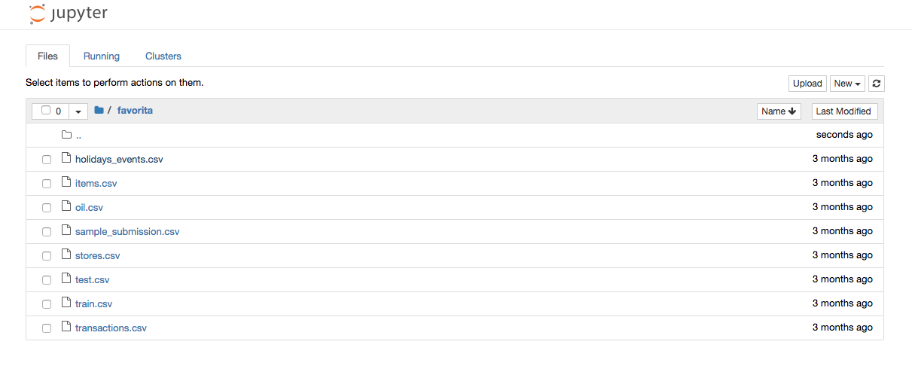

Because data sets can be very big, the loading of the data needs to be done from the command line and not the browser interface. **Kibernetika** has provided the ***kdataset*** utility to facilitate operations with data sets.

Before loading the first version of the data set, the Dataset object needs to be created. That can be done in the GUI in the ***Dataset*** section of your workspace. Or, the data set can be created during the downloading of the data by using “--create” or “--force” flags in the ‘push’ command.