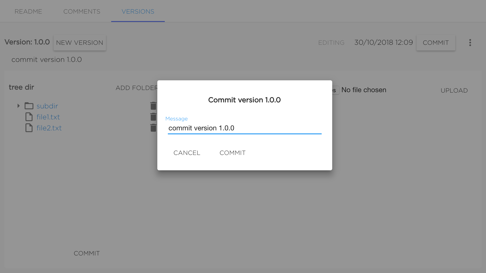
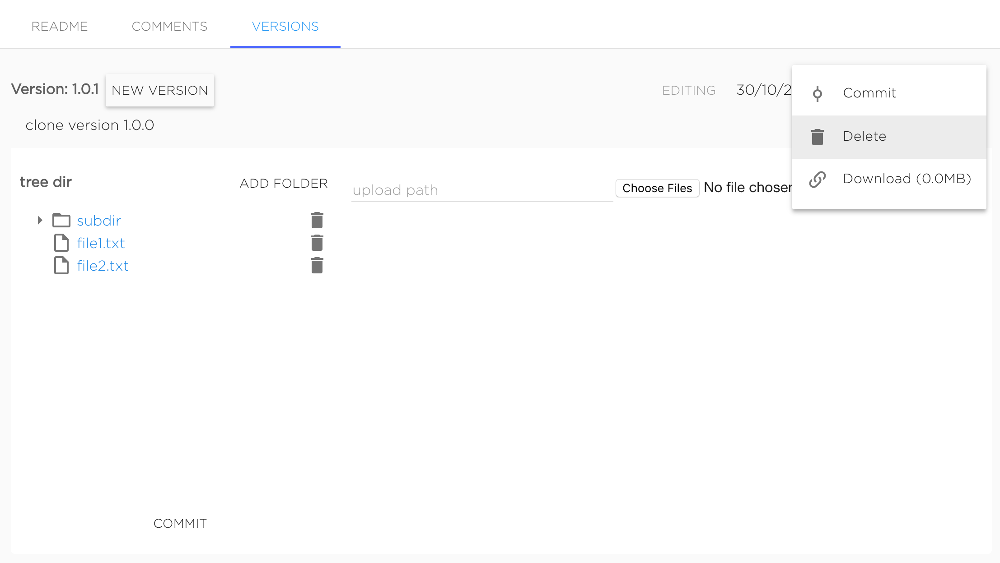

# Create dataset version

Dataset version can be added in UI. User should go to "Versions" tab and click "+ New Version" button.

Version name should be semantic versions. Message is optional.

Versions will be added after clicking "Create".

Also dataset version can be added with [kdataset tool](../tools/kdataset.md).

# Manage dataset version files

Just created dataset's version marked as Editing, it means that user can change version's contents.

User can upload new files and delete existing ones. To upload file to subdirectory it needs to set required upload path to "upload path" field. Not existing directories will be create automatically.

To delete file or directory user should click to bucket icon near object he wants to delete.

When dataset version editing is finished user should commit version by clicking button "Commit".

Version will be commited after setting the message (it's not required to change it) and confirming commit by clicking "Commit".

Commited version can not be changed. Only commited versions can be mounted to projects. User can preview files of commited version in UI.

Also commited version can be downloaded as archive.

# Clone version

Existing version can be cloned as new editing one by clicking button "New version" near existing version's name.

This action looks like creating new version, but cloned version will have all files from source version.

# Delete dataset

Dataset can be deleted from UI using context menu "Delete".

Also dataset version can be deleted with [kdataset tool](../tools/kdataset.md).
