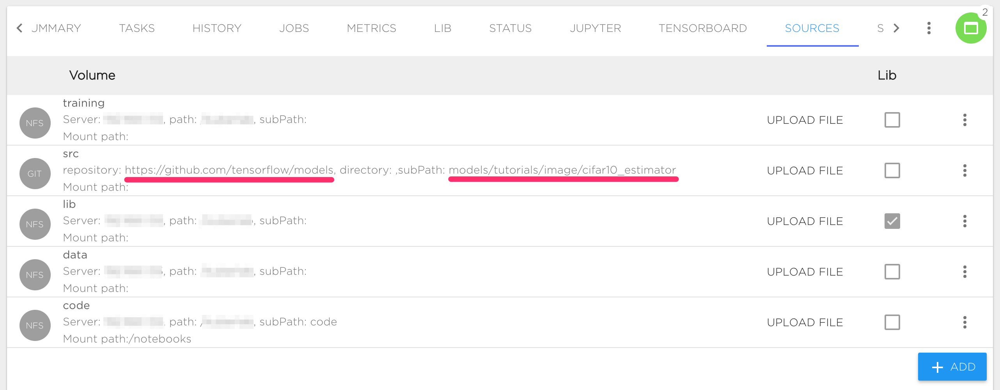

# Train CIFAR-10 Model from scratch using Kibernetika.AI

This tutorial shows basic steps required to train CIFAR-10 model using original source code from [https://github.com/tensorflow/models/tree/master/tutorials/image/cifar10_estimator](https://github.com/tensorflow/models/tree/master/tutorials/image/cifar10_estimator)

### Install Tensorflow project

- Start creating a new project in your Workspace. [More details](../projects/create-new-project.md)
- Set Tensorflow version 1.9.0
- Set source location to __https://github.com/tensorflow/models/tree/master/tutorials/image/cifar10_estimator__

_Notes:_

In this case, __https://github.com/tensorflow/models__ will be used as a Source repository and __models/tutorials/image/cifar10_estimator__ as a subpath:



Contents of this repository dir will be visible inside Jupyter or running Job under __$SRC_DIR__ path, usually SRC_DIR is an alias for __/norebooks/src__

### Prepare Dataset

First, we need to upload CIFAR-10 to Kibernetika. There are two options to upload data.

1. Upload data to some project directory, for example to __$DATA_DIR__.
2. Upload data to Kibernetika DataSet Catalog.

The second option is preferable as it will allow you to track versions of your dataset and also use the dataset in other projects.

Following steps required to upload dataset to catalog:

- Create new task __upload-dataset__ with resource __worker__ for dataset uploading. Inside the project, clone an existing task or create a new one from scratch.
- After creating the task we are ready to define the execution command for uploading. The CIFAR-10 project already has code for that. Our task definition looks like:

>


Basically we defined the following parameters:

- Execution Directory: __$SRC_DIR__ refers to the location our CIFAR-10 source code is
- Execution Command:
> ```mkdir /tmp/cifar-10 && python generate_cifar10_tfrecords.py --data-dir=/tmp/cifar-10 && cd /tmp/cifar-10 &&  kdataset push $WORKSPACE_NAME cifar-10:1.0.0 --create```
- Ensure that Source is mounted to your task. Open "Advanced" section at the bottom of form and check option "Default volume mapping" or add needed volume manually.

During running of the new task the following steps will be executed:

- Make temporary directory __/tmp/cifar-10__
- Use __generate_cifar10_tfrecords.py__ to upload dataset to __/tmp/cifar-10__
- Change current directory __/tmp/cifar-10__
- Push __cifar-10__ dataset to current workspace DataSet catalog (use environment variable __$WORKSPACE_NAME__ for current workspace) as version 1.0.0. Option __--create__ means create dataset if it doesn’t exist.

After execution __upload-dataset__  we can refer our __data__ directory to the created dataset. Change definition __data__ volume in the __Sources__ tab to point it to the newly created dataset:


_Notes:_

* __kdataset__ command is always present in Kibernetika environment
* you also could push dataset to catalog directly using python script:

```python
from mlboardclient.api import client
mlboard = client.Client()
mlboard.datasets.push(
    os.environ.get('WORKSPACE_NAME'),
    'cifar-10',
    '1.0.0',
    '/tmp/cifar-10',
    create=True,
)
```

### Standard Train model

To start training, we need to configure resource __worker__ in task __standalone__ to train the model.

* Set execution directory to __$SRC_DIR__
* Set execution command to:
>
```python cifar10_main.py --num-gpus=$GPU_COUNT --train-steps=1000  --data-dir=$DATA_DIR --job-dir=$TRAINING_DIR/$BUILD_ID```
* Set required __GPU__ count in the __Resources__ section
* Start task

_Notes:_

* __$TRAINING_DIR__ is an alias for preconfigured training directory, see __Sources__ tab
* __$BUILD_ID__ is an alias for sequential job id, every running job has a unique id
* __$GPU_COUNT__ is an alias for number of GPU allocated for execution on one compute node

You can see execution logs in the __Jobs__ tab. Use __Tensorboard__ tab to see your training progress. The result of model training is available under training directory __$TRAINING_DIR/$BUILD_ID__ (usually __/notebooks/training/1,2…__).

### Distributed training
> __ATTENTION:__ CIFAR-10 Tensorflow original model is based on tf.contrib.learn which was deprecated since Tensorflow 1.7 and distributed configuration is not compatible with newer tensorflow version. We recommend migrating your code to Tensorflow Estimators. In the Kibernetika platform you can use distributed training for both old and new style models, see details below.

First, we need to define resources that will be used for distributed training, e.g. workers and parameter servers.

* Change __parallel/worker__ Execution Command to:
>
```TF_CONFIG=$(tf_conf worker --chief_name master) python cifar10_main.py --num-gpus=$GPU_COUNT --train-steps=1000  --data-dir=$DATA_DIR --job-dir=$TRAINING_DIR/$BUILD_ID --sync```
* Set __parallel/worker__ Replicas Count to 2 or more
* Set __parallel/worker__ GPU Count to 1
* Change __parallel/ps__ Execution Command to:
>
```TF_CONFIG=$(tf_conf ps --chief_name master) python cifar10_main.py --job-dir=$TRAINING_DIR/$BUILD_ID```

Now we are ready to start distributed training. During execution the following process will be started:

* Two workers, one of them is chief
* One Parameter server

_Notes:_

* Remove __--sync__ options for asynchronous training, see Tensorflow documentation for more details.
* __tf_conf__ command is always present in Kibernetika environment

### Usage of __tf_conf__ command
__tf_conf__ is basic script that helps define the environment for Tensorflow distributed training.


```
usage: tf_conf [-h] [--worker WORKER] [--ps PS] {worker,ps,eval} [--chief_name CHIEF_NAME]

positional arguments:
{worker,ps,eval}  Set executable role

optional arguments:
-h, --help               show this help message and exit
--worker WORKER          Worker resource name
--ps PS                  PS server resource name
--chief_name CHIEF_NAME  Name for the chief worker. 'chief' for newer Tensorflow version and 'master' for tf.contrib.learn
```

Also, you could setup distributed configuration directly in your code:
```
from mlboardclient import utils
conf = utils.setup_tf_distributed(mode, worker_names='worker', ps_names='ps',chief_name='cheif')
os.environ['TF_CONFIG'] = conf
```

_Notes:_

* Please see __link__ for more low levels details about distributed training on the Kibernetika platform.
* Please see __horovod__ for using __Horovod__ and __OpenMPI__ for distributed training
