# Fast.ai v3 Deep Learning Course on Kibernetika.ai

This is a quick guide to starting v3 of the Fast.ai course. 

### Step 1:  Select Projects

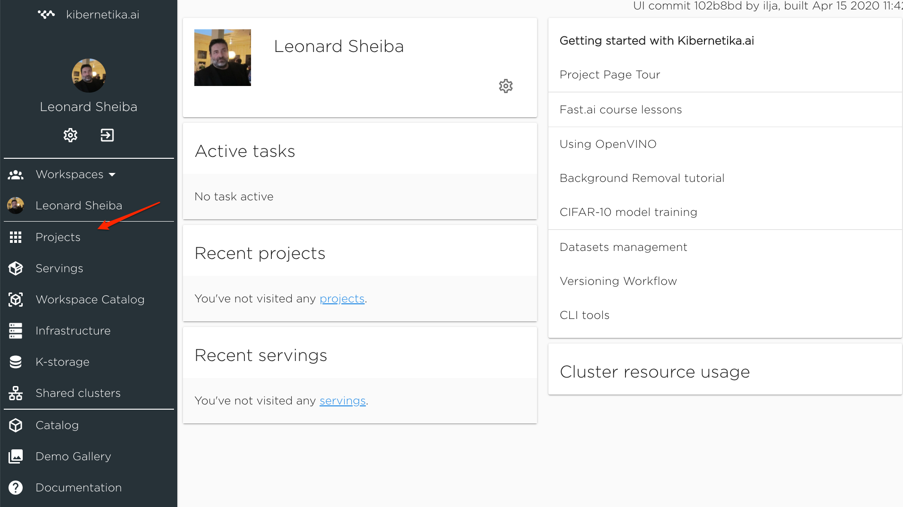

### Step 2: Create a new project.

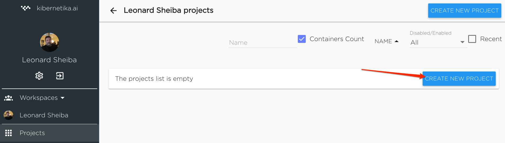

### Step 3: Select **fast.ai** template

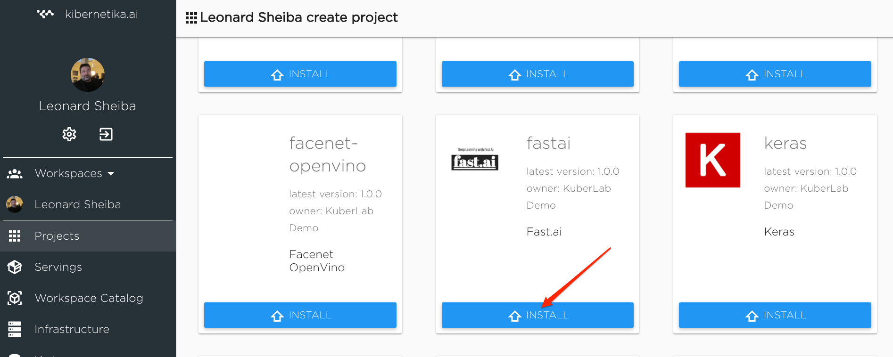

### Step 4: Run configuration  wizard
If you have multiple clusters available, select one to run project on.

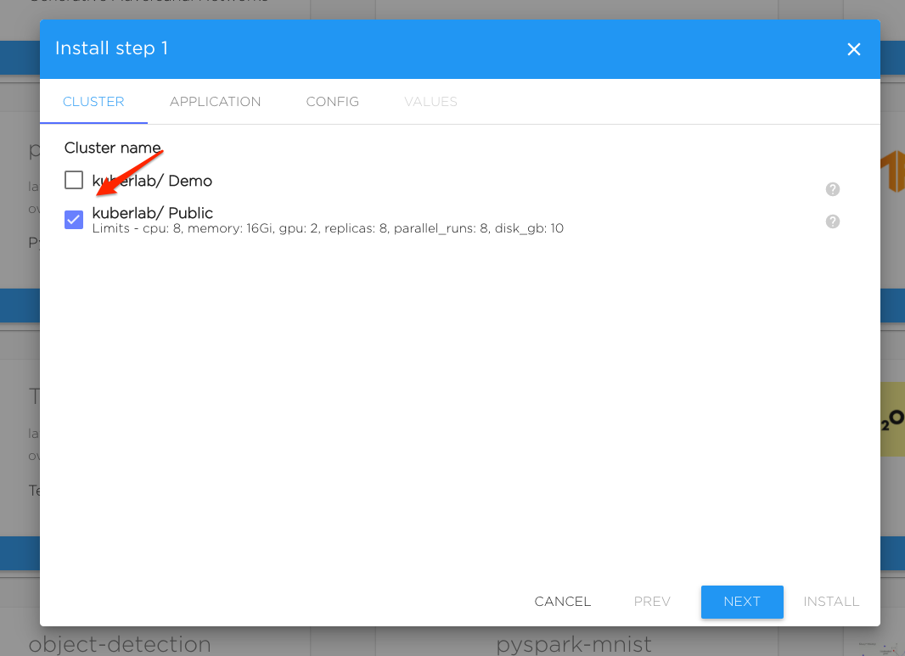

Name your project 

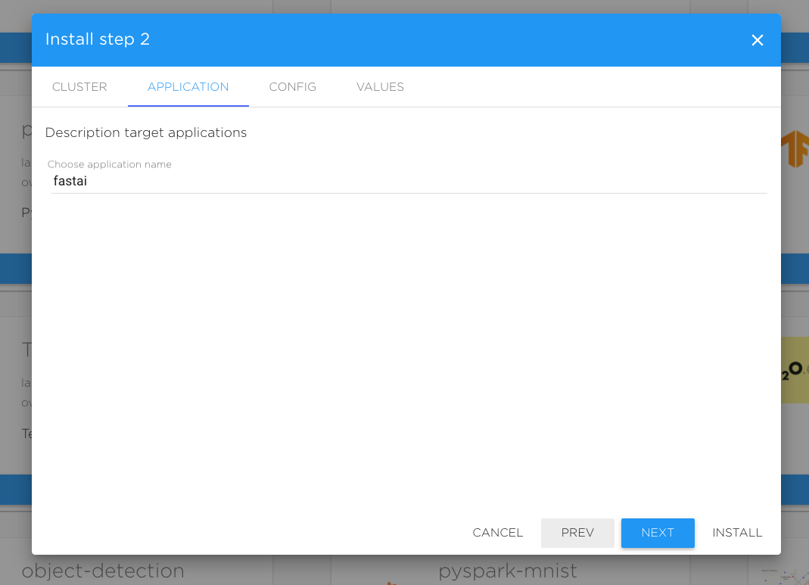

Configure resources. Storage **must** be selected.
It is suggested to enable GPU later, after configuration is done

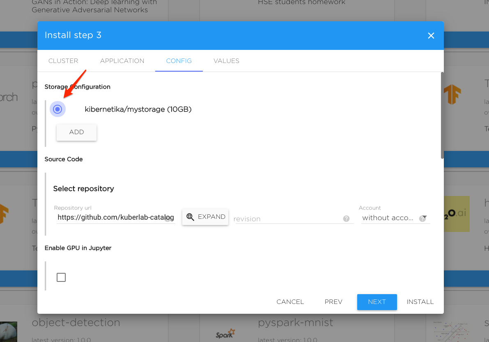

Finish installation

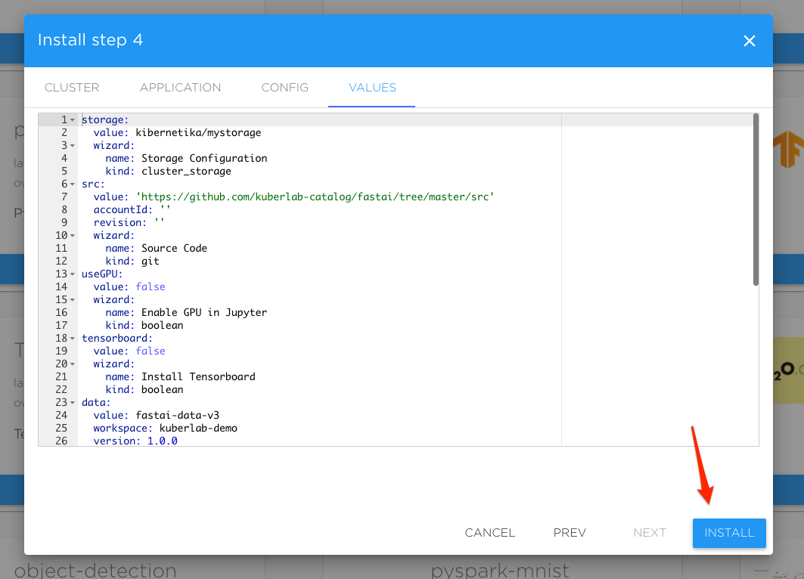

### Step 5: Complete the installation.
Project is configured and cloud resources are provoisioned. 

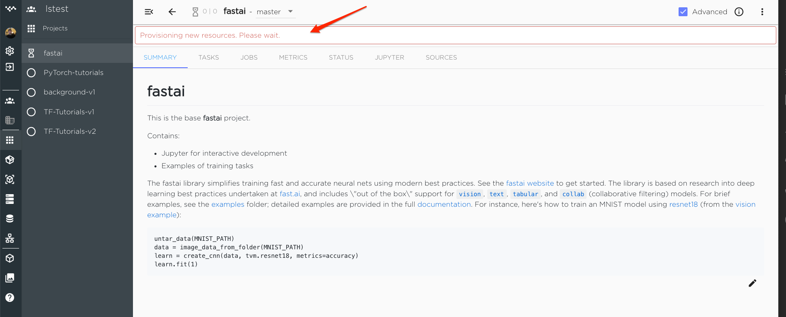

You can check the status of resources in the status tab.

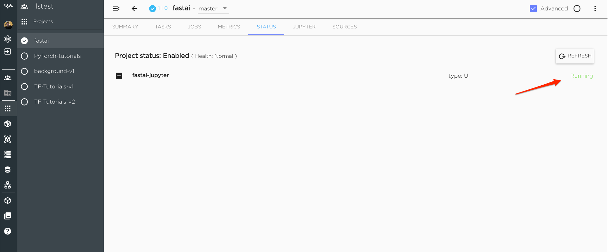

When resources are provisioned Jupyter will become available 

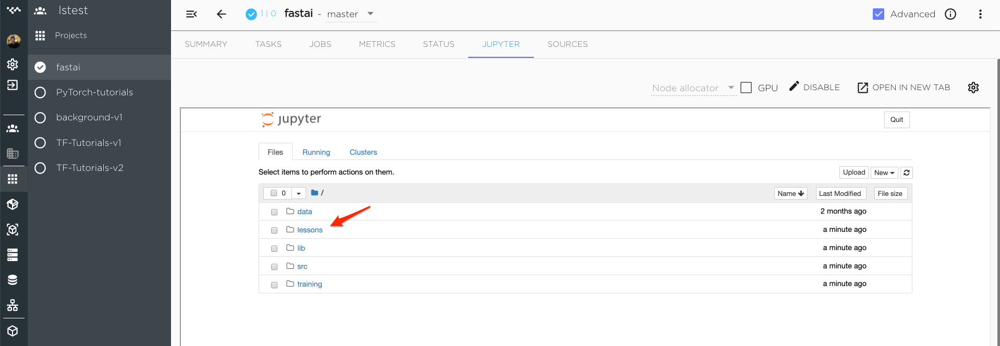

All the course lessons are ready

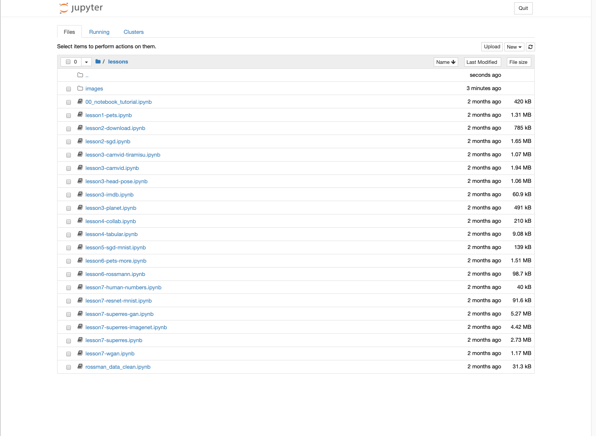

To enable GPU select the checkbox. It may take several minutes to deploy GPU cloud instance

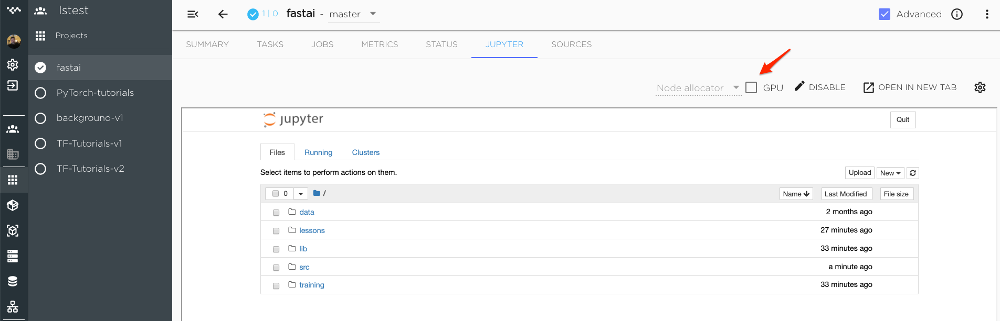

