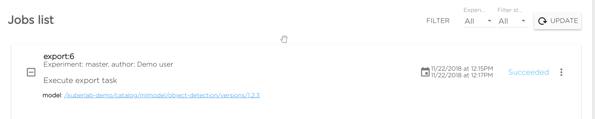
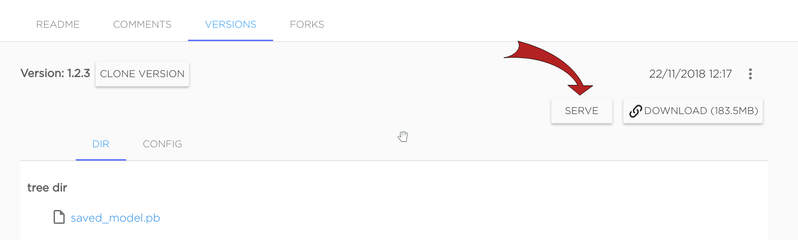

# Train model for object-detecion using object-detection API

Tensorflow object-detection training

## Running training

[Object detection pets dataset](https://cloud.kuberlab.io/kuberlab-demo/catalog/dataset/object-detection-pets/readme/) contains:

 - pets tensorflow record
 - pets label map
 - pretrained coco model (downloaded from [here](http://storage.googleapis.com/download.tensorflow.org/models/object_detection/faster_rcnn_resnet101_coco_11_06_2017.tar.gz))

To perform training, install [object-detection](https://cloud.kibernetika.io/kuberlab-demo/catalog/chart-mlapp-v2/object-detection/readme/) project on cluster using Kibernetika platform. [More details](../projects/create-new-project.md)

During installation, make sure to connect **object-detection-pets** dataset and **object-detection-code** model.

Then, it is ready to start training: run task named **train**.
Training with current settings will take several hours. You can change train steps number:

* Adjust (or add) argument `--num_steps` and pass the desired steps number.

However, while training is running we can start task **eval**: it takes last tensorflow training checkpoint and log some images with detections to
**tensorboard**. As the model training progresses, task **eval** can be performed many times to see the
detection correctness for the model.

## Export model

To export model, need to adjust some parameters for task **export**:

Change the execution command as follows:

* Specify **--train_checkpoint** argument according to num steps in task train
* Specify **--train_build_id** argument according to build id (task number) of task train
* Specify **--model-name** argument according to desired model name (**object-detection-pets** recommended)
* Specify **--model-version** argument according to desired model version

Then run task **export**. It will export TensorFlow saved model to the Kibernetika catalog
into the current workspace. When the task finishes, you will see the link to your model:

# Run serving, request and detection

There is a pre-trained [object-detection-pets model](https://cloud.kuberlab.io/kuberlab-demo/catalog/mlmodel/object-detection-pets)
which can be used for serving already.

Or, if you have run the export model from above, that model is ready for
serving too. Just follow the link you got in **export** task and you will see
the model page.

Once you are on the model page, click **Serve** near the model version description:

Then click **Serve** in the appeared form.