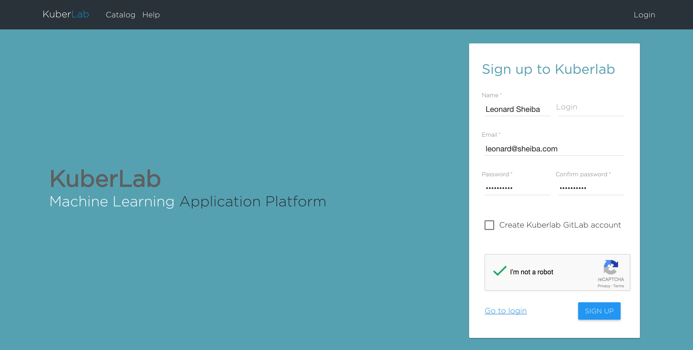
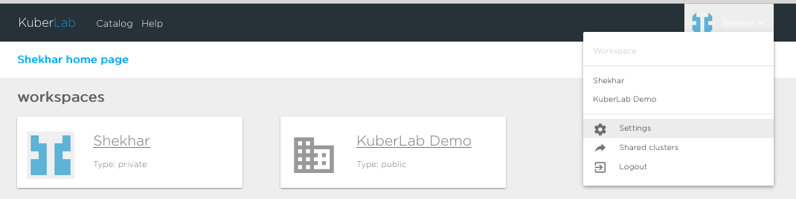
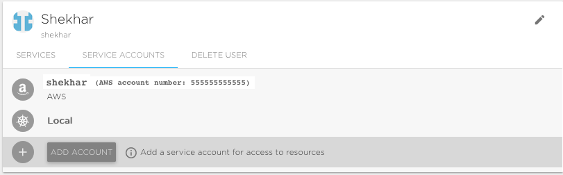
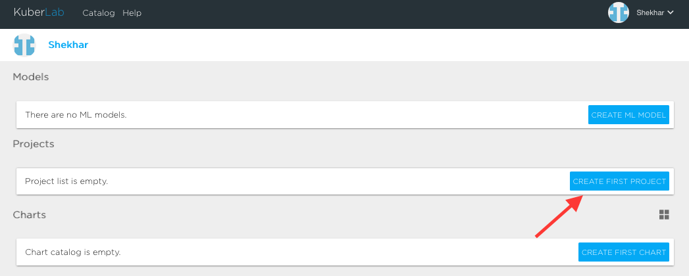
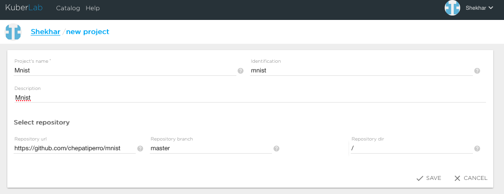
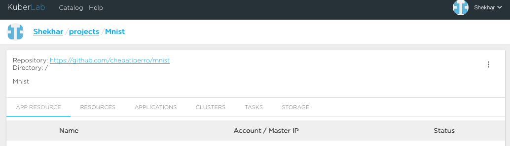
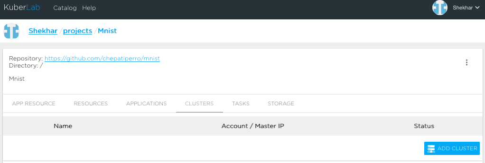
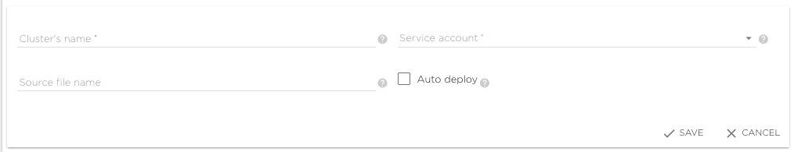
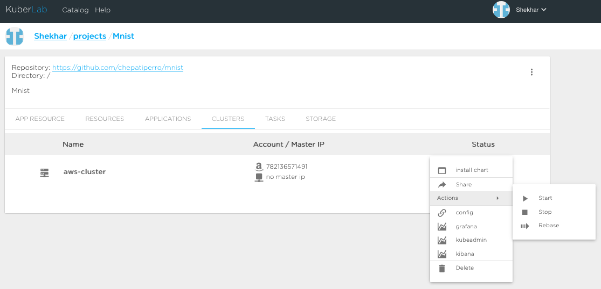
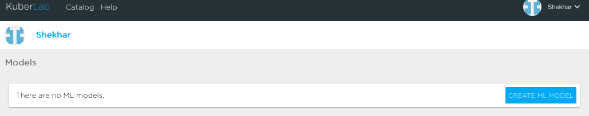

# Quick Start Guide

## Kuberlab Basics

This tutorial provides a step-by-step guide to initial setup of the Kuberlab Application Management Platform, which will help you automate the following:

* Infrastructure Management

* Application Management

* Integrating Public Applications

* Deploying Your Applications

## Requirements

1. Source code account on one of the following: Google, Github, Gitlab or Bitbucket

2. Cluster to run applications on, via one of the following: AWS, GCP or local Kubernetes server(s)

3. Model source code in Python or R

4. Kuberlab account

## Kuberlab Registration

You must have a Kuberlab account to use the platform. Once your account is created, you will be able to log into our system and connect your source code and cloud service accounts, so Kuberlab can perform all cloud automation on your behalf.

1. Go to the web page: [https://go.kuberlab.io](https://dev.kuberlab.io)

2. Sign up with your Email 

3. Wait for confirmation email and follow the instructions to confirm your registration. If you will not see the e-mail message from address "noreply@kuberlab.io", please check the Spam folder. If you did not receive confirmation e-mail, please contact support@kuberlab.com

4. After logging in, go to ‘Settings’ page (click your user name in the upper right, and then ‘Settings’). You can go to the page directly using this link: [https://go.kuberlab.io/settings/my](https://go.kuberlab.io/settings/my). 

5. Under ‘Services’, add and configure the source account that contains your application or model source code. 

### Source Account Registration

If you do not have a source account to store and host your model or application source code, you can create one with any of the following services at their respective sites:  
Google: [https://cloud.google.com/](https://cloud.google.com/)  
Github: [https://github.com/](https://github.com/)  
Gitlab: [https://gitlab.com/](https://about.gitlab.com/)  
Bitbucket: [https://bitbucket.org/](https://bitbucket.org/product)  

6. Under ‘Service Accounts’, add and configure the cloud service account where you will run your cluster. Currently Kuberlab supports Google Cloud, AWS, and local Kubernetes clusters.


### Cloud Account Registration

If you do not have a cloud service account to run your cluster, you can create one with the following services at their respective sites:  
Google: [https://cloud.google.com/](https://cloud.google.com/)  
AWS: [https://aws.amazon.com/](https://aws.amazon.com/)  

## Infrastructure Creation

Before you can do anything with an application, you need to create an Infrastructure for your project. You initialize your Infrastructure by selecting the source repository that your project will use.

1. From the main tab (click ‘Kuberlab’ at the top left), click the button on the right labeled 'Create new infrastructure'.


2. Type the name of your project, provide the link to your repository and type the name of the branch, then click ‘save’. If you are not using a particular branch of that repository, indicate that you are using master by typing 'master'.


Your project is now created.


## Cluster Selection

In order to run your application, you must add a cluster to your project. Make sure you have added a cloud service account in the Cloud Account Registration step above, as your cluster will run on your service account.

1. Go to the ‘Clusters’ tab under your project, and click ‘Add Cluster’. You need to name your cluster, choose the Service Account that the cluster will run in (AWS, GCP), and provide a file name – this will be a YAML file describing the cluster that gets added to your repository along with another file called ‘clusters.yaml’ that contains a list of clusters that you added.  

2. Once the cluster is added, it needs to be started. Click on the 3 vertical dots to the right of the cluster status, and under actions, click ‘start’. If the cluster starts successfully, the status will change to ‘Running’. 
It may take several minutes for a cluster start, depending on the cloud service provider and configuration.

3. If the cluster does not start and returns a status of 'Failed', check the log under ‘Tasks’. The logs are named by cluster name, and the latest is at the top. Click the ‘+’ to expand the log.

### Amazon Web Services

There are a few typical causes of cluster failure for AWS instances.

* Insufficient rights assigned to the AWS IAM user. In order to generate a cluster and bring up the various instances required, the IAM assigned to the service account must have access to IAM and EC2 via the AWS Management Console. 

* Incompatibilities in the VPC, ELB or EC2 instance. If starting the cluster fails during the start process, AWS does not remove the instances it has created, and you will have to delete them before attempting to start the cluster again. In order, and depending on where the unsuccessful start sequence failed, you must terminate the EC2 instance, delete the ELB, and delete the VPC. Then you can try to start the cluster again.

* Incorrect region specification in the YAML file describing the cluster. Amazon EC2 is hosted in several locations around the world, and each location is a 'zone' within geographical 'region'. In order to successfully deploy a cluster, the zone and the region specified in the YAML file must match and the instance must be allowed to create the cluster in the specified region. Availability is controlled by Amazon, and not all accounts will have access to the same zones, so you may have to change zones.

## Configure the Default Storage

Under the Storage tab, click on the cluster description under "Account / Master IP". This opens up a form to configure the default storage. Enter ‘default’ for the ‘Name’ and ‘Ident’ fields, click the box for ‘Default’, and for the ‘Server’, enter the NFS DNS Name from the cluster start log found under the ‘Tasks’ tab. The entry should look like the lines below, and the highlighted portion is the part that goes for the ‘Server’ entry. Default storage is automatically configured for AWS and GCP, but for private clusters you need to create it using the IP address of the storage.
```
2017-09-11T21:14:05Z     [INFO]    === NFS ===
2017-09-11T21:14:05Z     [INFO]    NFS DNS Name: fs-c1630b88.efs.us-east-1.amazonaws.com
```

## Create and Deploy the Application

To deploy an application to a cluster, you need a Kubernetes [Chart](https://github.com/kubernetes/helm/blob/master/docs/charts.md). If you know how to create your own chart, you can do so and add the chart by clicking ‘Create First Chart’ on the main KuberLab screen. Alternatively, you may use the chart from an existing application in the KuberLab catalog, and then modify it for your own purposes. You can create an application by adding a project from the main KuberLab screen, under the ‘Projects’ tab. Click "Create new project".


1. Select an application from the recommended list, or from the Catalog (link on top tab). The ‘tensorflow’ application is a good option if you don’t know what to use. Hit ‘next’.

2. Choose your cluster on this screen and hit ‘next’.

3. Name your application, or use the default already entered, and hit ‘next’.

4. Choose the versions you want for your applications, or use the defaults, and hit ‘next’.

5. Check the resulting application file and hit ‘install’.

Now you see your application configuration screens, that you can modify to configure your application. The configuration can be accessed by clicking on the three dots at the top right of the application screen, and clicking on ‘Edit’.


