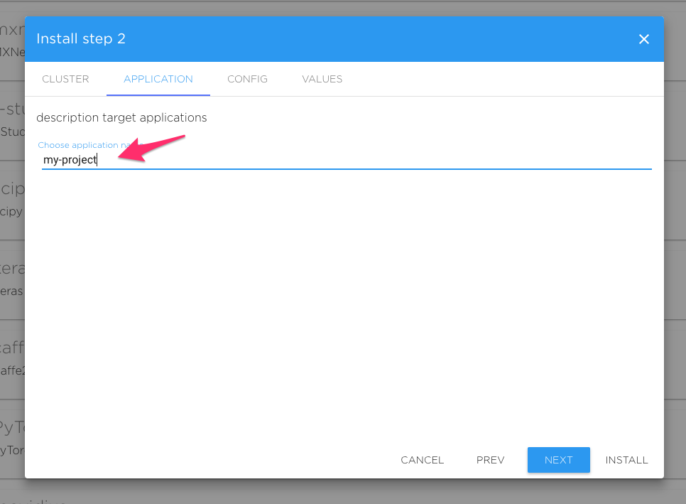
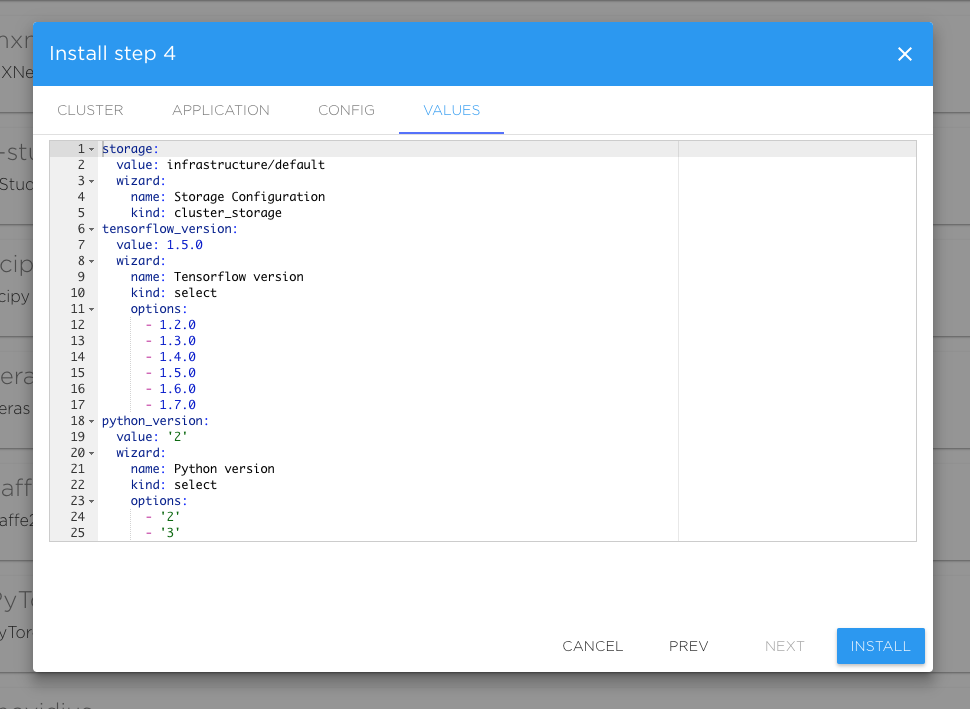

# **Spring Promotion**

During the months of April and May Kibernetika.AI service will be available for **FREE**.

- Individual trial account. 
- Collaboration with other users

* Unlimited use of CPU resource 
* 100 hours of GPU resource. 
* 10G cloud storage

- TensorFlow Tutorials
- PyTorch Tutorials
- Code for fast.ai machine learning course

Support is available at **support@kibernetika.ai** or on slack channel.

Training session over video conference is available upon request.

----
# Quick Start Guide

## Kibernetika Basics

This tutorial provides a step-by-step guide to the initial setup of the  **Kibernetika.AI Machine Learning** environment, which will help you run a sample application using a template from the catalogue. 

## Kibernetika Registration

You must have an account to use **Kibernetika.AI**. Once your account is created, you will be able to log into our system and connect your source code and cloud service accounts, so it can perform all cloud automation on your behalf.

1. Go to the web page: [https://cloud.kibernetika.io](https://cloud.kibernetika.io)

2. Sign up with your email address and other required information 

3. A confirmation email will be sent to you within 24 hours. Follow the instructions in this email to complete your registration. If you do not receive the e-mail message from the address "noreply@kibernetika.ai" within 24 hours of initial registration, please check the Spam folder. If you have not received the confirmation e-mail, please contact [support@kibernetika.ai](mailto:support@kibernetika.ai)

### [Optional] Source Account Registration

If you wish to run your own model or application source code, but do not have a source account to store and host it, you can create one with any of the following services at their respective sites:  

Github: [https://github.com/](https://github.com/)  
Gitlab: [https://gitlab.com/](https://about.gitlab.com/)  
Bitbucket: [https://bitbucket.org/](https://bitbucket.org/product)  

If you already have a source account, you can connect it to the Kibernetika.AI service:

1. After logging in, go to ‘Settings’ page (click your user name in the upper right, and then ‘Settings’). You can go to the page directly using this link: [https://cloud.kibernetika.io/settings/my](https://cloud.kibernetika.io/settings/my).

2. Under ‘Repositories’, add and configure the source account that contains your application or model source code. 

### [Optional] Cloud Account Registration

**Kibernetika.AI** provides you a shared cluster to run your applications. You can also configure to use your local Kubernetes cluster. Hence a cloud service account registration is optional. If you do not wish to use the shared cluster you will need to either configure a local cluster, or use a cloud service, and connect this to Kibernetika.ai service.

If you need a cloud service account to run your cluster, you can create one with the following services at their respective sites:  
Google: [https://cloud.google.com/](https://cloud.google.com/)  
AWS: [https://aws.amazon.com/](https://aws.amazon.com/)  

To configure your cluster in the **Kibernetika.AI** service:
1. Go the the 'Settings' page as before (see Source Account Registration).

2. Under ‘Service Accounts’, add and configure the cloud service account where you will run your cluster. Currently Kibernetika supports Google Cloud, AWS, and local Kubernetes clusters.

## Project Creation

Before you can do anything with an application, you need to create a project.

1. If you want to run one of the tutorials in the catalogue, you can create a tutorial project. In this case, click on the 'Catalog' button at the top. If you however want to build your own code, or use your own from your connected repository, in your workspace select project tab and then click the button on the right labeled 'Create new Project'.

2. From the list of tutorials, or sample templates shown, choose the most relevant (click the 'Install' button). Click "Install", and then choose your workspace in the wizard that pops up. If you unsellect "Recommended", the whole list of sample templates will be displayed.

3. Choose your cluster. Clusters available for your organization  will be displayed in the list. Choose the cluster where you want to create the new project. Then click 'Next'.

4. Name your application. Most users will leave the default name as is here. Click 'Next'.

5. Choose the versions of various tools you need. Most users will use the default values here. Click 'Next'.

Scroll down to access additional configurations

6. The last step of template installation shows the configuration. There is no need to modify anything here. Click 'Install'.

This will install the template and take you to the project screen.

## Running your Project

In the project screen, you will see several tabs. You can run your code from the 'Tasks' tab. This tab is used for the production flow, and allows you to define several tasks that can be run either serially or in parallel, and any number of combinations of both.

The 'Sources' tab allows you to navigate the directory structure and look at all the template files. If you wish to connect your own sources, you can do this here, by adding a new source path.

The 'Jobs' tab contains a list of all the jobs you have run and the details of all tasks currently running.

You can monitor your application from the 'Metrics' and 'Tensorboard' tabs.

'Status' shows the current status of all tasks you have started.

The 'Jupyter' allows you to step through the code and read the notes, hence is the easier method. 

