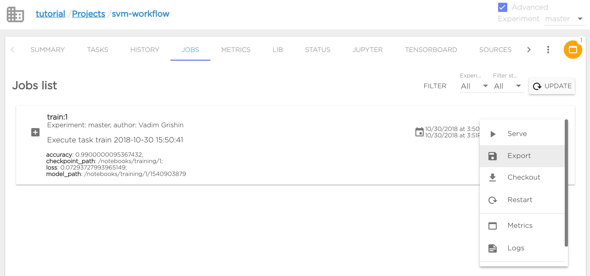
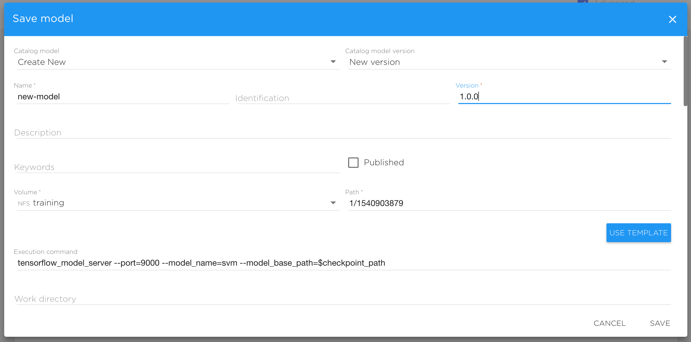
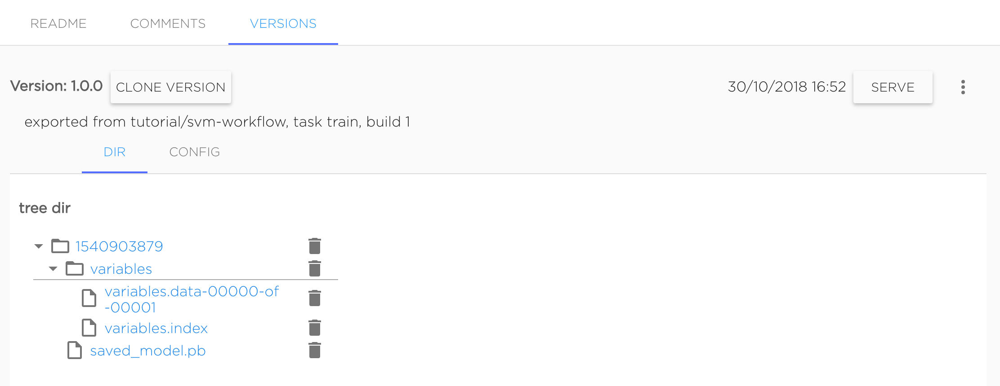

# Models

Models looks like [Datasets](../datasets/datasets.md) with additional data that provides models serving. Also models can be served.
Many model's functions are the similar with datasets but also models have any differences.

First of all models has additional description for serving suck as serving configuration and specification for UI form.

Also all models has Status, it can be "uploading" for models that currently still exporting from task, "ok" for success and "error" if any error occurs on task exporting.

# Create model

Model can be created from scratch similarly to [Dataset creation](../datasets/datasets.md#create-dataset).

Also model can be exported from Project as Job's result. It can be make from "Export" option in job's context menu.

User can choose existing model and versions in current organization, or can set new model or new version of existing model - they'll be created automatically.

After clicking "Save" job will be exported to model.

# Managing models and versions

User can [update](../datasets/datasets.md#update-dataset-metadata), [delete](../datasets/datasets.md#delete-dataset) and [fork](../datasets/datasets.md#fork-dataset) Models in the same way as [Datasets](../datasets/datasets.md), also user can [create](../datasets/datasets.md#create-new-dataset-version), [clone](../datasets/datasets.md#clone-version) and [delete](../datasets/datasets.md#delete-version) Model versions in the same way as Datasets versions.
Differences are described below. 

# Model and version configurations

Like the Datasets Models have base parameters Name, Identification, Keywords, etc...

But also Models have description for serving configuration and specification described in section [Model serving](../serving/serving-start.md#model-serving).

Configuration described directly in Model is default and this configuration is inherited in all Model versions except those versions with specifically described configuration.

Model's default configuration can be edited with "Edit" option in Model's context menu. Version's configuration can be set in "Config" tab for every version.