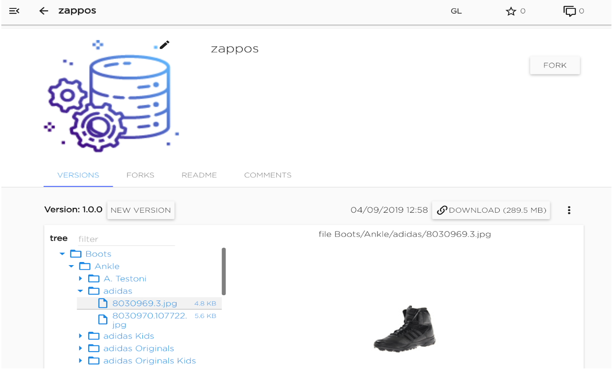
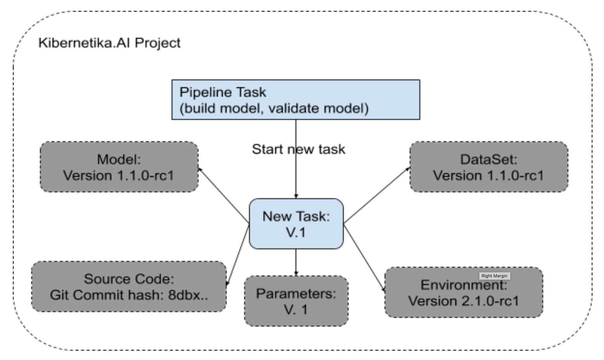
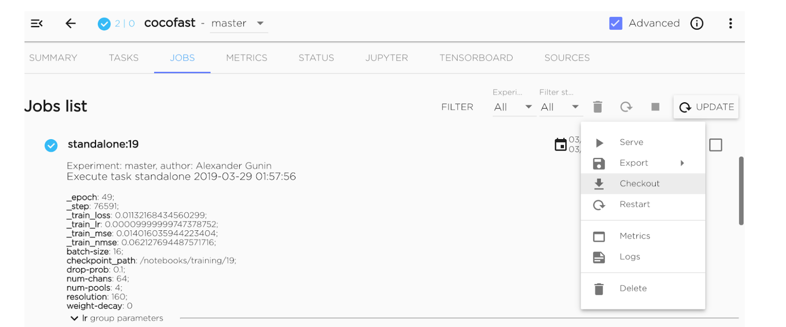
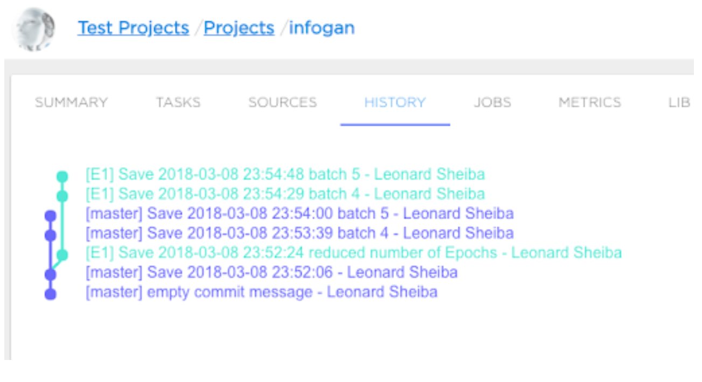
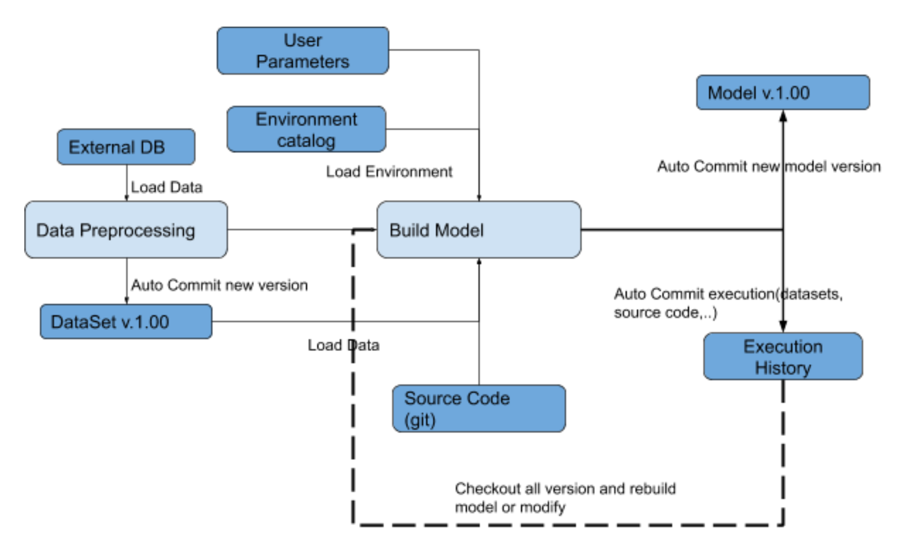

# Kibernetika.AI Versioning and Lifecycle Management

It's a well-known fact that Machine Learning (ML) requires a lot of trial and error. Experimentation is key. The procedures that people use to prepare training data and tune training parameters are very iterative. In order to facilitate this kind of software development, you have to track the code, configurations, and data used for ML experiments so you can always answer the question of how a model was trained.

In Kibernetika.AI datasets and trained models are placed in the catalog from which they can be accessed for use in the model development pipeline or for serving and deployment.

Kibernetika.AI catalog support versioning of both datasets and models. It is highly recommended to use data versioning during ML development to be able to:
* Retrain model on the same data
* Validate a newly developed model on the known data
* Build a reproducible model training pipeline
* Track the changes to the data, including malicious tempering 

The Kibernetika.AI concept of data and model versioning is similar to GIT LFS. Git is used to versioning the data file tree structure and files metadata. The files in the dataset are sliced into chunks and stored in the object storage.

Kibernetika.AI platform provides following Dataset and Model catalog features:

* Incremental versioning
* Low storage overhead to add additional data to datasets or models catalog
* Fast delivery data to compute resources
* Forks for sharing datasets between workspaces or organizations
* Role-based access control and security for objects stored in the catalog
* Global, organizational and user-level catalogs and object visibility and access

***Kibernetika.AI ML Project and Pipeline versioning.***

The main concept behind the Kibernetika.AI ML Project and Pipeline is reproducible model training, validation, and inference. It means everything in the ML Project should be versioned and the user should be able to reproduce the result at any time or check out the previous model build or validation task and start it again, with or without modifications. For that purpose the Kibernetika.AI platform will provide:

* Environment versioning - a version of the execution environment, all libraries and packages used, hardware and software configurations
* Dataset versioning
* Model Versioning
* Source code versioning
* Hyper Parameter versioning

Every task executed in the ML Project will be committed to the execution history and will contain the following information required to check out task execution:

* Commits hash of the task source code
* Environment version. 
* Container version
* The Version of data
* The version of external models
* Hyper Parameter 
* Resources required for the execution
* Log files produced by the task
* System metric history(CPU,GPU,Memory)
* Model metrics: Accuracy, Loss, etc….

The checkout command will generate all the information required to repeat the experiment or the whole production pipeline.

The example of versioning history with experiments and branches of experiments

Example of a pipeline using versioning:

Kibernetika.AI workflow with versioning example:
 
*Create a new project from one of the provided environment templates*

*Prepare the dataset*

2. Configure data preparation
    * Define the execution command and specify the source code to execute.
    * Choose execution environment from the provided list or create a new one

3. Run data preparation
    * Monitor task logs and system metrics(CPU, Memory,...) at runtime
    * Auto commit new data to dataset catalog
    * Auto commit to the execution history all data/configuration required to check out that task

*Develop the model*

4. Configure data preprocessing
    * Define the build command and specify the source code to execute.
    * Define validation command to run validation in parallel
    * Choose execution environment from the provided list or create a new one
    * Configure required resources for execution
    * Configure parallel training

5. Run model building
    * Monitor task logs and system metrics(CPU, Memory,...) at runtime
    * Monitor model-specific metrics such as Accuracy, Loss at runtime
    * Auto commit new model to model catalog
    * Auto commit to the execution history all data/configuration required to check out that task

For the model deployment look at the Kibernbetika.AI Serving Architecture document
