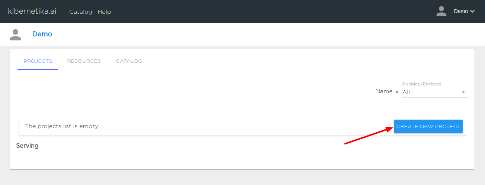
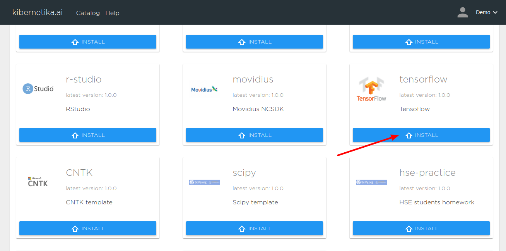
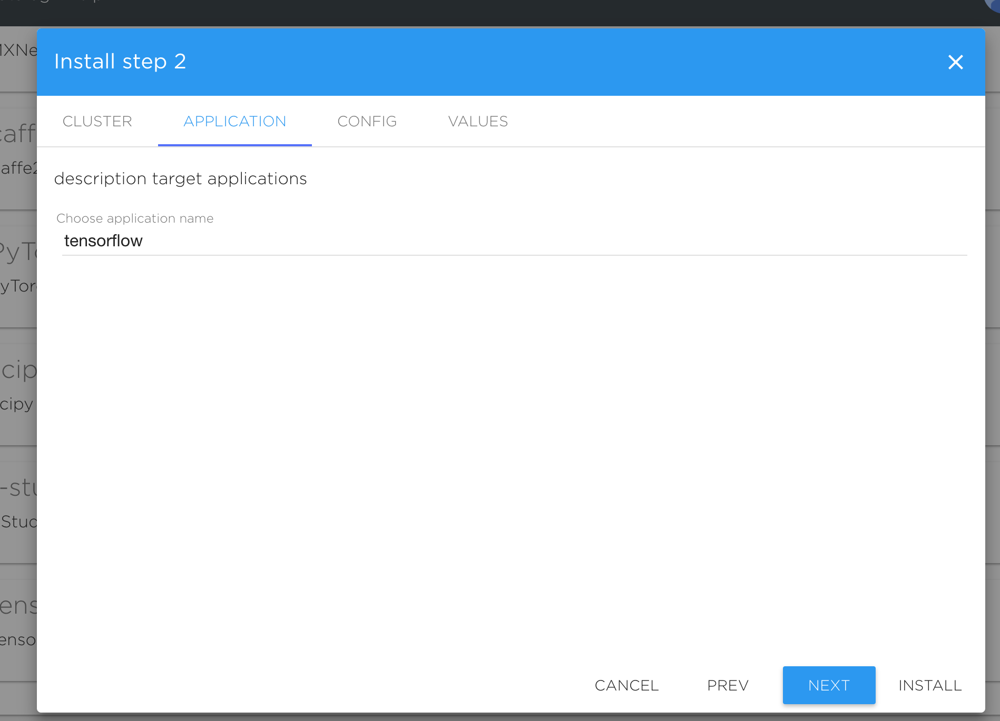
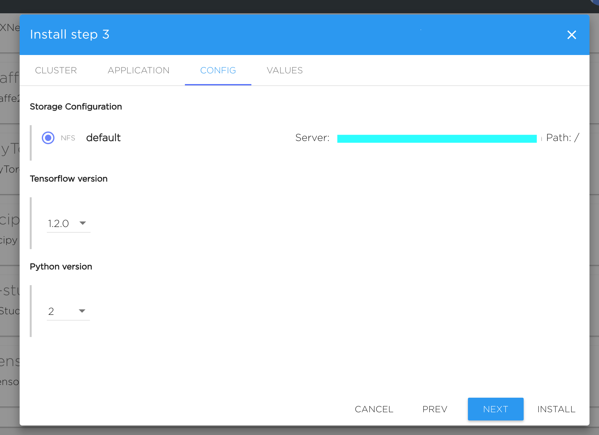
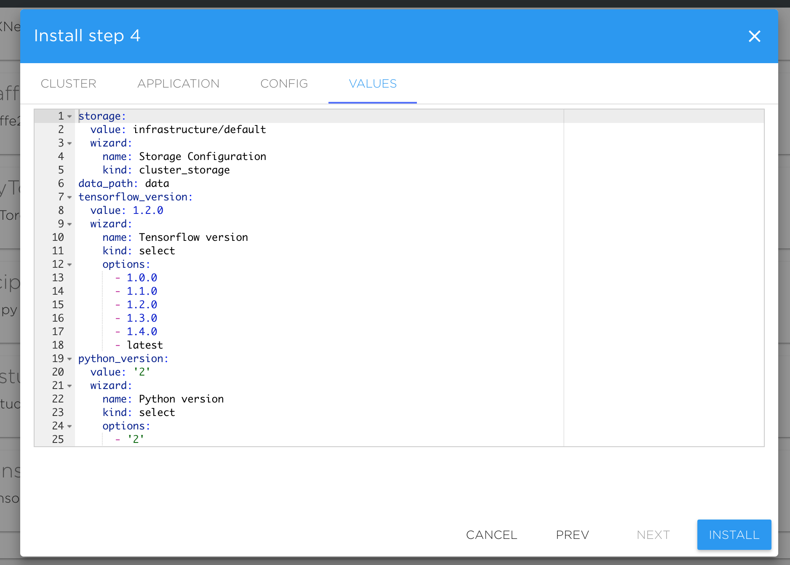
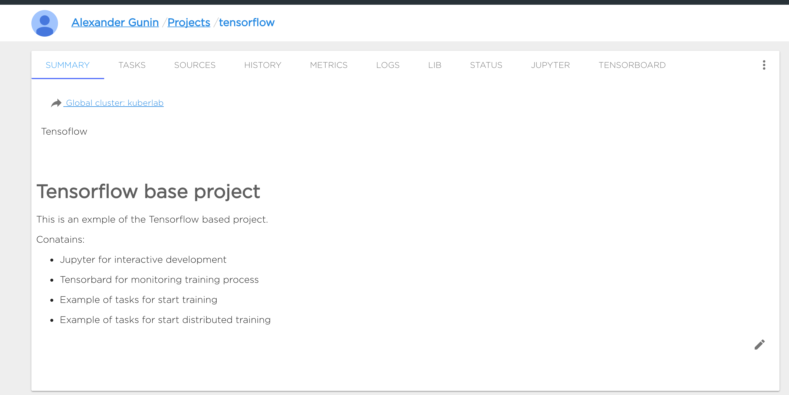

Project is the environment for development and lifecycle management of ML/AI application. You can find a lot of templates and pre-built Projects in the **Kibernetika** [catalog](../catalog/work-with-catalog.md#Install project from catalog). You can create new project using [UI interface](create-new-project.md#Creating empty project from UI interface) or [using command line tool](create-new-project.md#Creating empty project using **Kibernetika** command line tool).

### Creating empty project from UI interface
1. Open your workspace and select projects tab.

2. Press "Create New Project" button or use context menu button to create a new project and choose one of the template to use for your new Project.

4. Set your project name. Valid name must be 63 characters or less and must begin and end with an lower case alphanumeric character ([a-z0-9]) with dashes (-) and lower case alphanumerics between.

5. Make basic configuration of your project and select a ***Kibernetika Storage*** (/Resources/KibernetikaStorage.md) or a ***cluster storage*** (/Resources/Clusters.md) available for your cluster.

6. One more time verify the final configuration of the Project and press install button.

7. Yore are almost done. Now you have completely configured environment to work with your ML/AI application. Please see [Work With Project](working-with-projects.md) for additional documentations.

### Creating empty project using Kibernetika command line tool
Coming soon.
