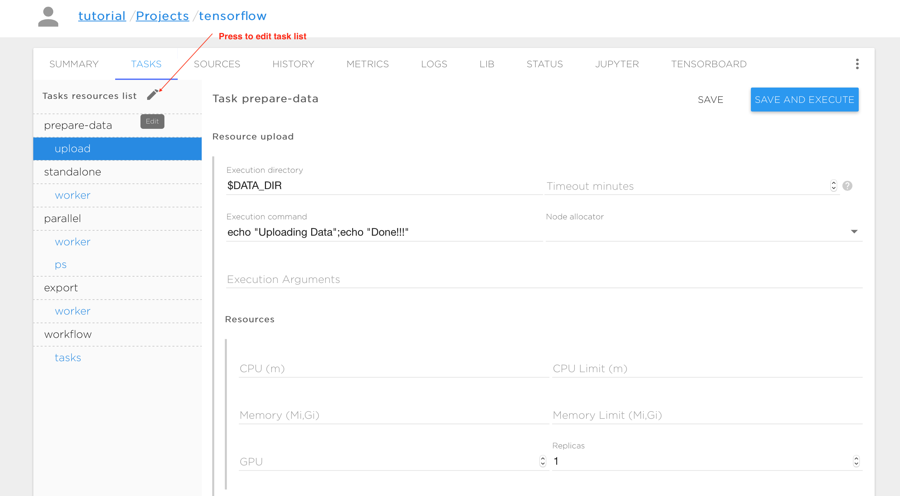
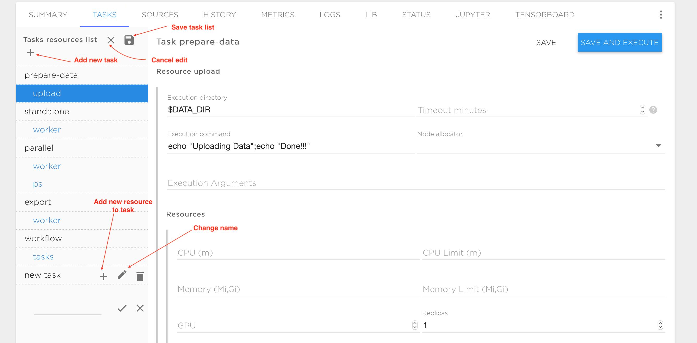
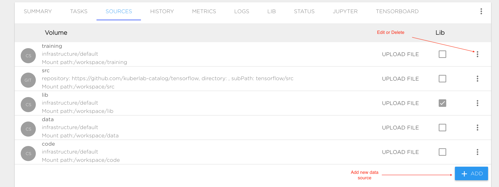
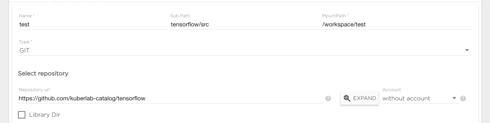
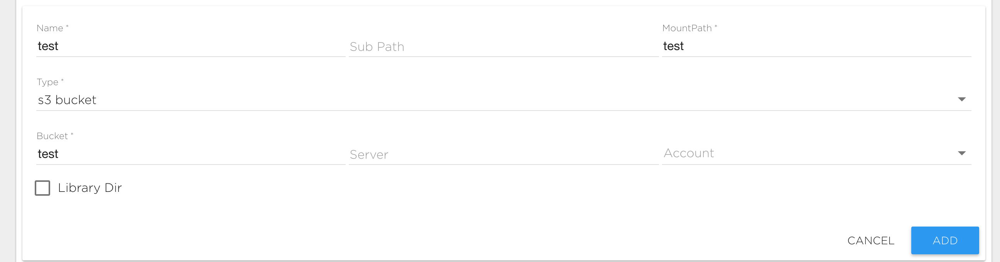
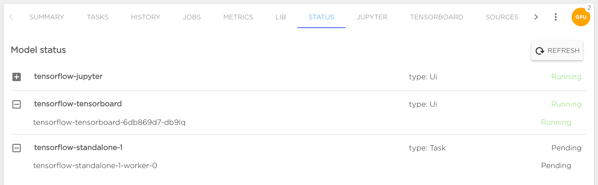

# Project Summary

The project summary ('SUMMARY' tab) contains descriptive information and additional materials for your project. You can enter any information here that you want to go with your project. Use the edit (pen) symbol at bottom right to start editing content. The supported format for this content is [Markdown](https://en.wikipedia.org/wiki/Markdown)

# Task management

The typical way to execute your AI application is to run it with tasks ('TASKS' tab). Thus, every project contains a number of tasks that the user can schedule as required. All base project templates and tutorials from the Kibernetika catalog already have some preconfigured tasks. You can modify those tasks, or remove or create new ones.

Every task consists of one or more execution entities (like processes or threads) that are called 'resources'. Distributed processing typically requires multiple replicas of resources running in parallel. A resource may have any number of replicas. Each replica is executed inside the container during task execution, and the replicas can communicate with each other through the TCP or UDP protocols.  In the figures above, the tasks and resources are shown in the vertical pane on the left. The upper-level names are the tasks (prepare-data, standalone, parallel, export, workflow, etc.) and the indented names are the resources within each task (upload, worker, ps, etc.) Each resource has a form on the right of the task pane, to control the execution. The following variables are available to control resource execution and replication in an execution container:

| Variable | Purpose | Example values |
| ------------ | ------------- | ------------ |
| GPU_COUNT | Number of GPU instances available for each replica | 0,1, ...,n |
| PYTHONPATH | Location of the python library  | $LIB_DIR:.... |
| REPLICA_INDEX | Index of the current resource replica. Required for distributed training | 1,2,... |
| upper_case({ResourceName})_NODES | comma separated list of dns addresses resource replicas | T1-R1-0-0.R1-0,T1-R1-0-1.R1-0,... (where T1 task name,R1 resource name) |
| BUILD_ID | Id of current task run | 1,2...,n |
| upper_case({SourceName})_DIR | Mount point for Source with name 'SourceName' | /workspace/src |

The following is a list of parameters used to specify task execution:

| Field | Purpose | Example values |
| ------------ | ------------- | ------------ |
| Execution directory | Directory to run user commands in | $SRC_DIR |
| Timeout | Time to wait for a compute resource | 300 |
| Execution command | Command to start the compute process | python styles.py --job_name=worker --train_dir=$TRAINING_DIR/$BUILD_ID  --task_index=$REPLICA_INDEX --ps_hosts=$PS_NODES --worker_hosts=$WORKER_NODES |
| Resources | Minimum and maximum compute resource requirements | Requires at least CPU=100m, Memory=62Mi, but no more than CPU=4000m, Memory=8Gi and GPU=1 for each resource replica | 
| Environment variables | User defined environment variables | MY_VARIABLE = value |
| Images | Container images that will be used for cpu and gpu | (tensorflow/tensorflow:1.2.0,tensorflow/tensorflow:1.2.0-gpu) |
| Default volume mapping | Useful to mount all sources to container as they are defined in the sources | true or false |
| Default mount path | Fixed prefix to the mount points for all sources |
| Volumes | Custom sources to be mounted to the container | (data, subfolder, /mynewfolder/andsubfolder) |
| Node Allocator | For public clouds only. Template to allocate new compute resources on the public cloud if there aren't resources available | Template name from your cluster configuration |

# Working with sources
A project requires data sources to be configured for training data, model source code, results and checkpoints. You can configure all data sources in the "SOURCES" tab and mount it to different Tasks or to specific Project components like Jupyter or Tensorboard. We support the following data source types:

* GIT: Git repository. You can connect you GitHub, GitLab or BitBucket account or use any other git server with your Kibernetika account.
* NFS: External network file system that supports the NFS protocol.
* Cluster Storage: Storage attached to your cluster by your administrator (in case of a local cluster), or provided by the Kibernetika service. See ***Cluster Storage*** for details.
* S3 Bucket: Storage that uses your S3 bucket as a data source.

When you create a project using either the recommended templates, or a tutorial or sample from the Kibernetika catalog, the required sources are automatically created for you. To add new storage or edit the existing entries, click on the "SOURCES" tab in the Project screen.

Configuration:

* Name: Data source name. Valid names are 63 characters or less and must begin and end with an lower case alphanumeric character ([a-z0-9]) with dashes (-) and lower case alphanumeric characters in between. 
* Sub Path: Optional field. Path to mount the directory inside attached file system.
* Mount Path: Path inside the Project. This is a required field.
* Type: Choose one of the data source types. This is a required field.

## Git data source
To connect a git data source you need to specify the following fields:

* Repository: Git repository path, like https://github.com/Kibernetika-catalog/tensorflow. You can use the "Expand" button to specify repository details if you have connected a git account in the [user settings](../settings/user.md#repositories).
* Sub Path - by default content of git repository will be visible in the Project under "MountPath/RepoName". By specifying Sub Path you can change this behavior. For example if your repository has "src" folder and you want to mount its content to  "MountPath/" you should set "Sub Path" to "RepositoryName/src".
* Account - Account must be set for private repository if you want to be able to commit changes. You need to provide secret that hold user private data, like access key or deploy key. See [service account management](../settings/user.md#service-accounts)

Note that the "Account" field is required only if you have a private Github repository. Unless you have such a repository configured in the user settings, this field will remain unavailable (set to "without account").

## NFS data source
This is an external network file system that support the NFS protocol. To connect a NFS source type you need to specify the following fields:

* Server: The IP address of your NFS server.
* Path: NFS internal path.
* Mount Path: The file path at which you want the data available.
* Sub Path: Path to data inside the NFS volume. For example if your want to mount the directory "/mypath/data" from the NFS server to  the directory "/MountPath/data", you should set the mount path to "/MountPath/data" and the sub path to "/mypath/data"

## Cluster Storage
This is storage attached to a shared cluster or to a cluster from your infrastructure. If you do not have cluster storage configured, contact your administrator or support.
To connect cluster storage you must specify one of the available cluster storages. See ***Cluster Storage*** and [Kibernetika Storage](../resources/kibernetika-storage.md) for information about creating and managing this data source type.

<mark>ATTENTION</mark>: The following rules are applied to the 'Sub Path' field:

* If Sub Path begins with the '/' symbol then the data will be visible for all projects in your organization and you can share this data to other projects belonging to the same organization. 
* If the Sub Path begins with '/shared/' then data  will be visible to everyone who has access to the same storage volume, even from another organization.
* Otherwise data will be visible only inside your project.

## S3 Bucket Storage
This is storage that allows working with S3 bucket data. To connect a S3 source type you need to specify the following fields:

* Server: The address of your S3 server. Leave it empty for Amazon S3.
* Bucket: The bucket name.
* Account: Secret that holds the user's private credentials that will be used for the S3 connection. See [service account management](../settings/user.md#Service Accounts)

# History
This tab shows a list of all resource instances run, with some details about them.

# Jobs
Coming soon.

#Metrics
This tab shows various metrics of used resources in current project. Resources are grouped by user's tasks, project UIX components (Jupyter, Tensorboard, etc...) and servings.

UIX components and servings metrics can be displayed for user selected time period (from last 5 minutes to 1 last day).
Tasks metrics can be shown for whole task execution period (but not longer than 1 week) with the user specified interval (from 10 seconds to 1 hour).

The following metrics are available:
  
- __CPU usage__ in percents
- __Memory usage__ in Megabytes
- __GPU usage__ in percents
- __GPU memory__ in Megabytes
- __GPU power draw__ in Watts
- __GPU temperature__ in Celsius

# Status
Status tab shows actual containers statuses:

Also it's available to see events on problem nodes, in following example case we can see problems with repository mounting:

# Integrate Project to your workflow engine
Coming soon.
