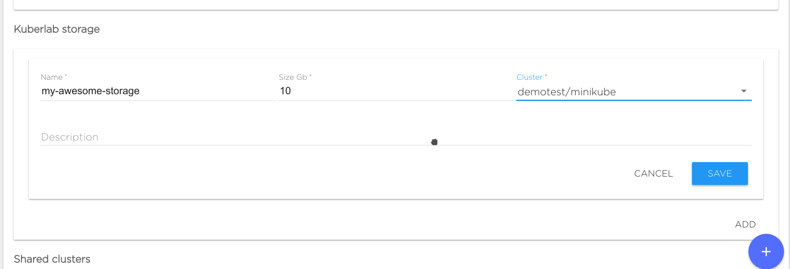
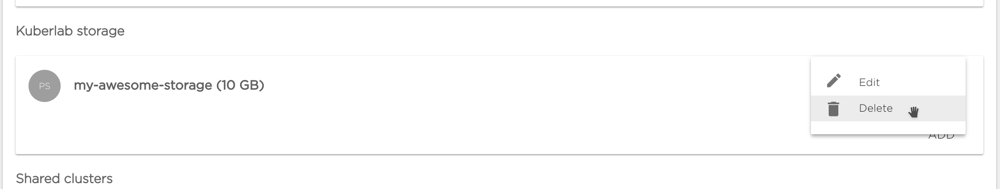

### Create new Kibernetika Storage

**Kibernetika Storage** is essentially a persistent volume which can be used for any data in a project.
To create a new **Kibernetika Storage** go to <workspace> -> Resources tab and scroll down to **Kibernetika Storage**.
Click Add, then specify storage name, size in GB and connected cluster (and optionally description):

### Delete Kibernetika Storage

To delete **Kibernetika Storage**, just simply click **delete** in storage options:

