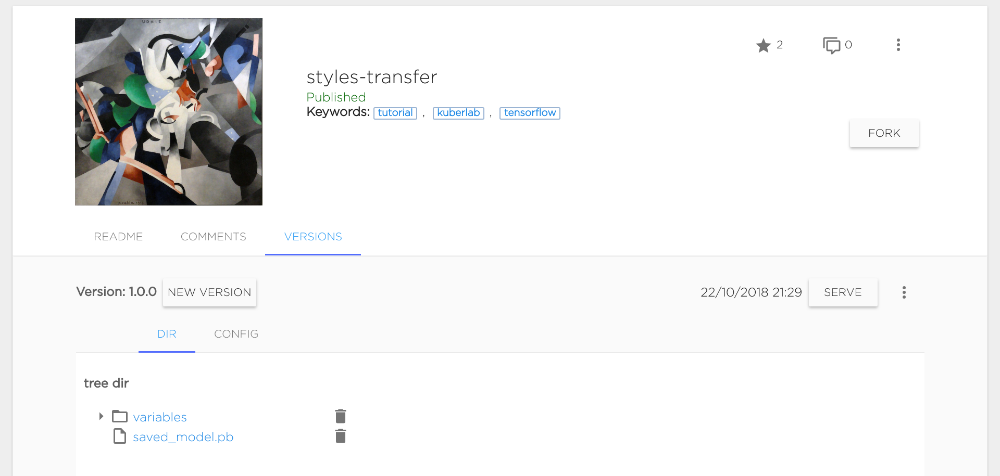
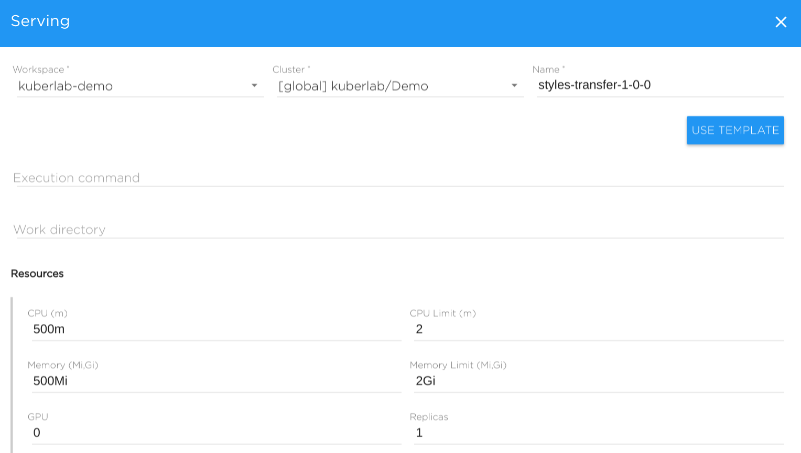
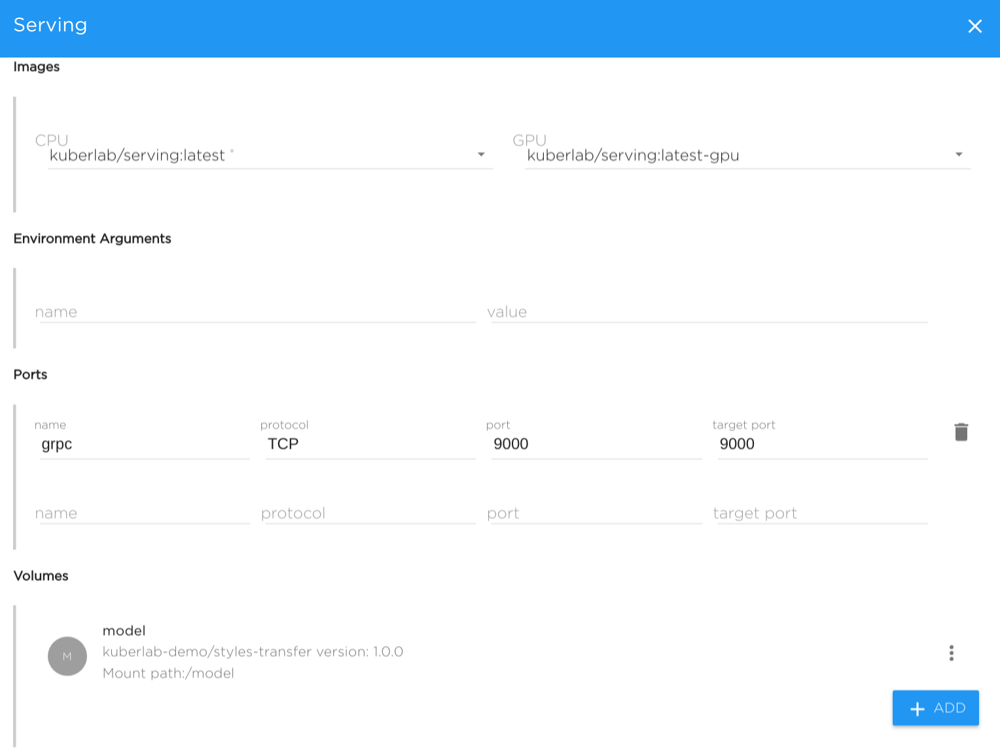
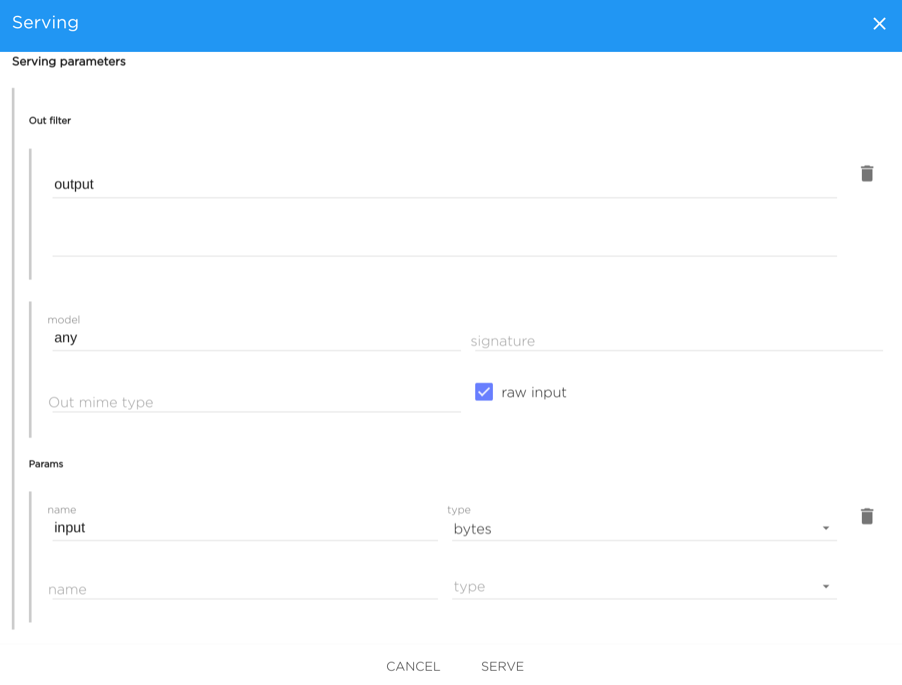

## Model Serving

Once you have created a model and pushed it to the catalog, you will
see the new model version on the **Versions** tab on the model view:



Now you are ready to serve the model.

Serving the model means that there will be a running TCP/HTTP server
which accepts incoming requests with data in the appropriate format,
runs inference with this data and give the output as the response.

To serve the model, click the **Serve** button near appropriate version.
You will see the serving configuration form which basically specifies
execution command, environment, data and resources for the serving object.

Let's see all the parameters in details.



#### General parameters

* **Workspace** - name of workspace, where serving will be run.
* **Cluster** - choose cluster where serving will be run physically.
* **Name** - specify a name for the serving.
* **Execution command** - Bash execution command. Supports any bash-like constructions.

Usually, execution command for serving is a call to model runner command
line tool, such as:

* **tensorflow_model_server**
* **kibernetika-serving**

For **tensorflow_model_server**, it may be like

```
tensorflow_model_server --model_base_path=<model_versions_dir> --model_name=my-model --port=9000
```

For **kibernetika-serving**, it may be like

```
kibernetika-serving --driver tensorflow --model-path <saved-model-dir> --port 9000
```

**Note:** For the **kibernetika-serving** tool description and details, see
[here](kibernetika-serving.md).

* **Work Directory** - specifies command current directory. Usually set to
one of volume directory alias - such as **$SRC_DIR**

#### Resources

* **CPU** - CPU resource request (examples: **500m** (0.5Core), **2** (2 Cores))
* **CPU limit** - CPU resource limit
* **Memory** - Memory resource request (examples: **512M** (512 MB), **2Gi** (2 GB))
* **Memory limit** - Memory resource limit
* **GPU** - Number of allocated GPUs per each replica
* **Replicas** - Number of replicas (basically, the number of servers)



#### Images

* **CPU** - Docker Image used when not using GPU.
* **GPU** - Docker Image used for GPU

**Note**: For **kibernetika-serving**, image **kuberlab/serving:latest** is
usually used, see [kibernetika-serving](kibernetika-serving.md) document for the details.

* **Environment variables** - pass additional environment variables
* **Ports** - specify ports which will be opened in container: **name**, **protocol**, **port number**

* **Volumes** - TBD (See detailed description at the Volumes page)



#### Serving parameters

Serving parameters only needed for the correct filling and passing
parameters values from the Web UI: that is, you can pass number or string
to your serving, or even upload a file (say, a picture).

* **Output filter** - only specified parameter names will be returned to
the UI, e.g. **output** - will return only **output** key-value in JSON.

* **Model** - UI will pass the given model name to the serving
(important to **tensorflow_model_server**-based servings).
* **Signature** - UI will pass the given model graph signature to the serving
(applied only **tensorflow_model_server**-based servings).
* **Output MIME Type** - is specified, the UI will treat the output as this MIME type.
* **Raw input** - If marked, inputs sent in data key `inputs` instead of older `features`.

#####  Params

Specify a set of input parameters: their name and type. Types can be the following:

* **int8**
* **int16**
* **int32**
* **int64**
* **int** (basically it is int32)
* **float**
* **double**
* **byte** - if this specified, the form for file uploading is shown in the UI.
Data is passed to the serving as byte array.
* **bytes** - if this specified, the form for file uploading is shown in the UI.
Data is passed to the serving as an array of byte arrays containing 1 element.
* **string**
* **uint8**
* **uint16**

On the started serving, you can pass multiple numbers (for numeric types)
separating them by commas.