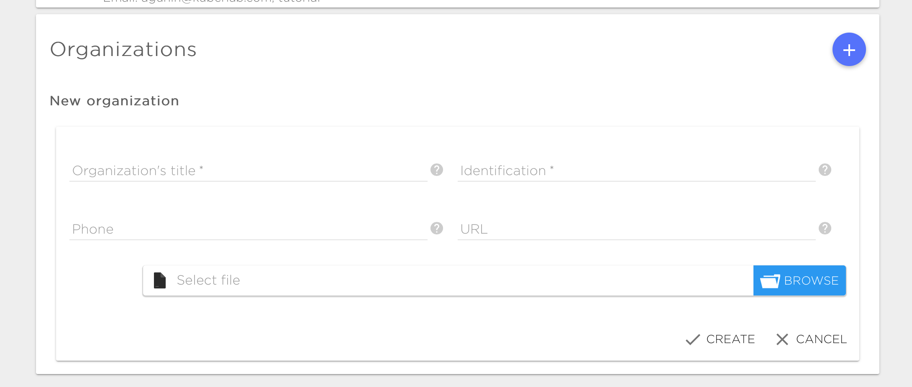
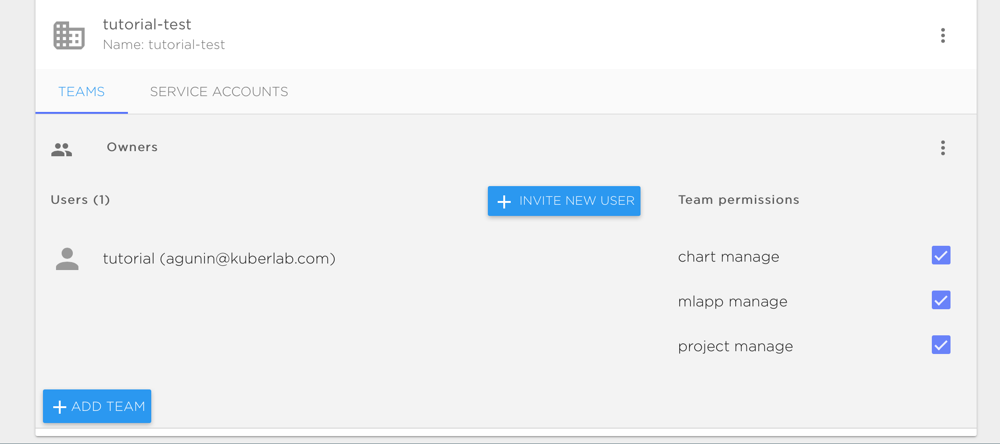

# Organizations

An organization is a construct used to centralize projects and resources that are inter-related and need to be managed under a single umbrella. These projects and resources then live under the organization, and billing goes through a single central organization account. You can create different teams under the organization hierarchy, set up access permissions for each team and invite specific users to each team.

## Creating a new organization

Creating a new organization is done from the 'settings' page.

You will need to fill in the following fields:

* Title - The visible name of the organization.
* Identification - This is filled automatically with a default. You can provide your own identification by changing the default. This field is used in the URL which points to your organization. A valid identification string must be 63 characters or less and must begin and end with an lower case alphanumeric character ([a-z0-9]). Between these, it may have dashes (-) and lower case alphanumeric characters. 
* Phone - Contact phone number for the organization. 
* URL - Web page for the organization. 

## Creating Teams

After an organization has been created, you can create different teams under the organization and set up access groups for those teams. By default, there is only one team named 'Owners'. The users in this team have full permissions that allow them to manage Infrastructures, Projects, Teams, Billing Information(if available) and Users for that organization.

# Service Accounts

See [user service accounts](../settings/user.md#service-accounts) for details.

# Billing

See [user billing](../settings/billing.md) for details.

