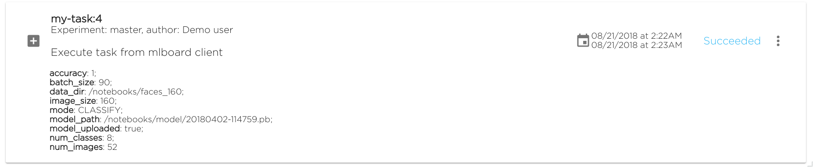

## Working with tasks

This section describes the essential use cases in **mlboardclient**
tasks API.

### Start, run and wait

To start another task using mlboardclient, need to get appropriate task config first:

```python
from mlboardclient.api import client


mlboard = client.CLient()
app = mlboard.apps.get()

# Get task config from project config
task = app.tasks.get('my-task')
```

Once we get the task config, we can run it. This method starts a task,
then automatically refresh it's state every 2 seconds and waiting task
for complete. Once task is complete, it returns the completed task object:

```python
task.run()
<Task name=my-task build=4 status=Succeeded>
```

Another way to run task - is to control every stage manually. Start task
first - method `start()` creates a new runtime task execution and immediately
updates task properties:

```python
task.start()
<Task name=my-task build=4 status=Starting>
```

Task status can be updated using `refresh()`:

```python
task.refresh()
<Task name=my-task build=4 status=Running>
```

**Possible task states**: *Starting*, *Pending*, *Running*, *Failed*, *Succeeded*.
The last 2 ones are the terminal states. Once the task is completed, it must have
the status Failed or Succeeded.

To check task for completeness, it is possible to see `completed` property:

```
task = task.refresh()
if task.completed:
    ...
```

Then we can check for concrete task status:

```
if task.completed:
    if task.status == 'Succeeded':
        print('Ok, my-task successful!')
    elif task.status == 'Failed:
        print('Ooops, task has been failed')
        # Or fail entire script
```

### Task logs

One more logical thing to do - is to grab task logs after or during
execution. For instance, if a task failed, then it would be great to show
it's logs to see what was happened:

```
if task.status == 'Failed':
    print('Ooops, task has been failed, getting logs...')
    # Get the logs dict(pod_name => log)
    logs = task.logs()
    for k, v in logs.items():
        print('Logs %s:\n' % k)
        print(v)
```

Code above will give all logs including the "master" pod (it is the most
unnecessary one). Let's skip it:

```
if task.status == 'Failed':
    print('Ooops, task has been failed, getting logs...')
    # Get the logs dict(pod_name => log)
    logs = task.logs()
    # Delete master log, we are interested only on workload log
    del logs['master']

    for k, v in logs.items():
        print('Logs %s:\n' % k)
        print(v)
```

### Update task runtime properties

During task execution, it is important to know the info about critical
and sagnificant values and variables. They can be exported using
`update_task_info()` method and then they are shown in the UI:

```
properties = {
  'accuracy': 1,
  'model_path': '/notebooks/model/20180402-114759.pb',
  'mode': 'CLASSIFY',
  'batch_size': 90,
  'image_size': 160,
  'model_uploaded': true,
  'data_dir': '/notebooks/faces_160',
  'num_classes': 8,
  'num_images': 52,
}
task.update_task_info(properties)
```




