**Image Background Removal**

This is the tutorial showing the implementation of background removal functionality. It is used as in a photo editing and in video prodduction as a replacement for a greenn screen. It also can be used in virtual background for video calls.

The tutorial is using Tensorflow  v1.14 and will show end-to-end steps from the creation of the prokject to deploying background removal functionality in the cloud.

#### Create Project. 

- Go to the Projects page and create a new project,
- In the template selection page choose Tensorflow 
- You will be presented by the project configuration wizard:
- Install screen 1: Select the custer to use for your project. For GCP select kuberlab/Public
- Install screen 2: Choose the Project name. In tthe tutorial we will use background-remove
- Go through Install screen 3 and 4 without any changes
- Congratulations, you created the new project 

**Connect GitHub repository with tutorial source code to the project**

In the SOURCES tab
* Edit **src** volume
* In the **Select Repository** section, change repository url to https://github.com/kibernetika-ai/demo-zoo
* Set **Sub Path** to demo-zoo 
* SAVE
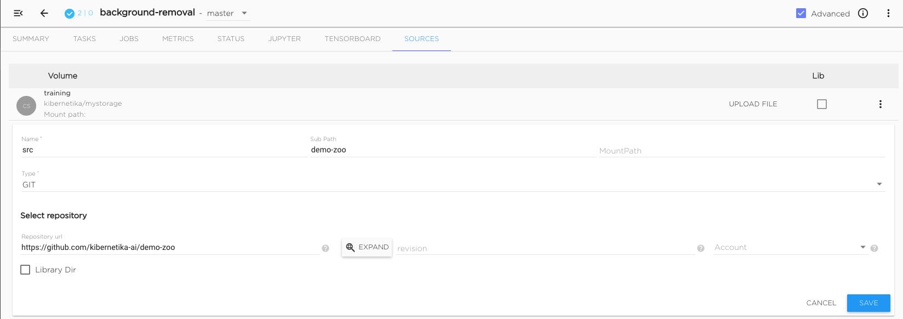

#### Prepare Dataset  

**Download COCO dataset**

In the JUPYTER tab
* Open Jupyter configuration to configure Jupyter for data processing task
* In the Settings: Resource Jupyter: Images: CPU, replace the image to kuberlab/serving:latest
* SAVE

*It may take several minutes to change the image.
In the STATUS tab you will be able to see the status of the project components.*

- Download COCO dataset from http://cocodataset.org/#download

+ From the JUPYTER tab and open new Terminal window and execute following shell commands
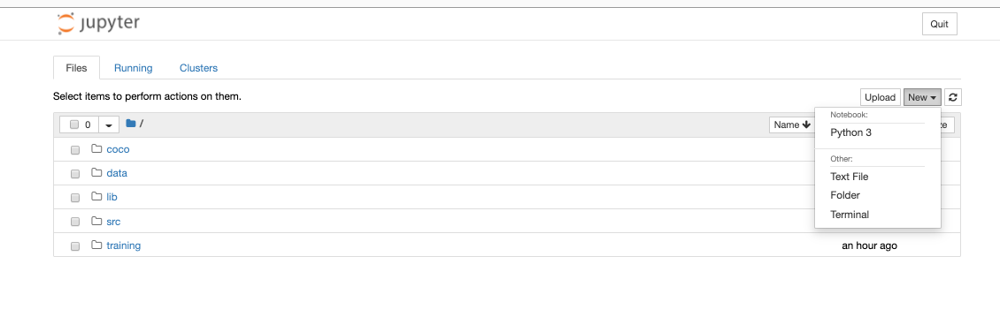


``` 
mkdir coco; cd coco
wget  http://images.cocodataset.org/annotations/annotations_trainval2017.zip
wget http://images.cocodataset.org/zips/train2017.zip
unzip annotations_trainval2017.zip; rm annotations_trainval2017.zip
unzip train2017.zip; rm train2017.zip
```
- Close terminal

**Notebook for DataSet processing**

In the JUPYTER tab

  * In the filemanager open /notebooks/src/models/fastbg folder
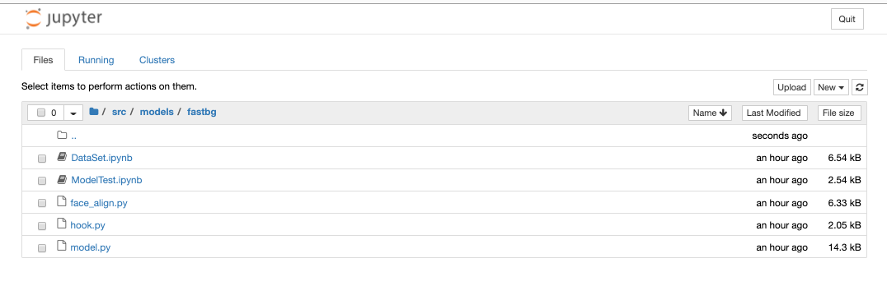

  * Open DatSet.ipynb notebook
DataSet notebook contains code to convert COCO dataset to suitable for training format
  * Run “Run All” command
You will see several images for verification. The first version of people-mask dataset is pushed into the catalog to create the placeholder for the final dataset which will be created later by the pipeline task.
  * To see the newly created dataset open Catalog and in the search field type people-mask. From the search results select people-mask dataset. You will see Version 1.0.0 which was just created

**Make dataset people-mask available to the project background-v1**

* Open  SOURCES tab
* Edit “data” volume
* Change storage type to “Dataset” which is the first item in the list of the available types
* Change dataset to people-mask version 1.0.0
* SAVE
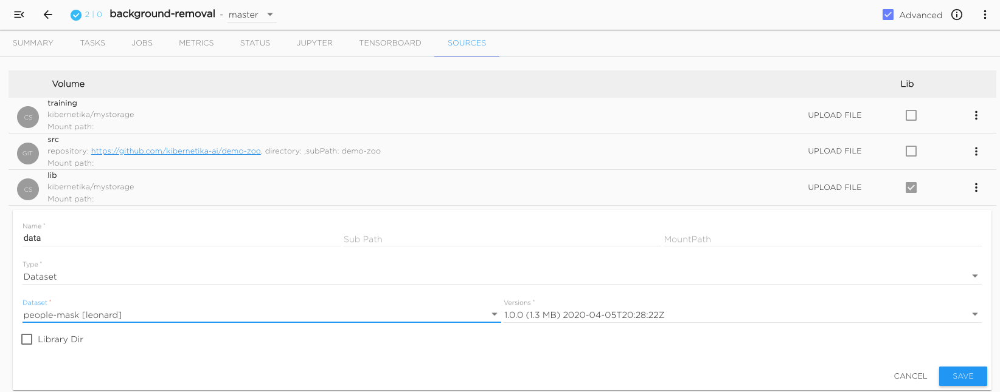

#### Pipeline Workflow 

**Create pipeline tasks**
In the TASKS tab

Create **data** task
  * Remove task “parallel” by selecting task and deleting it from the menu
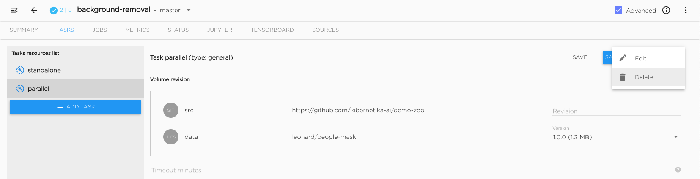
  * Rename task “standalone” to “data”
  * Select “standalone”
  * Open task edit form
  * Change ”standalone” to “data”. Task type stays “generic”
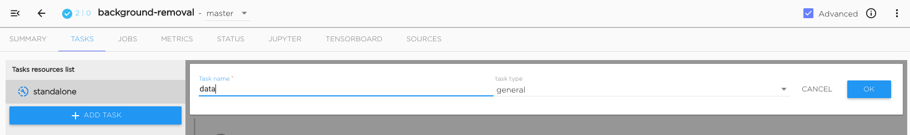

Create **train** task
  * Press “ADD TASK” and select “data_copy”
  * Change task name to “train” and press OK
  * Press “SAVE”, it is always a good idea to save the latest step of the project
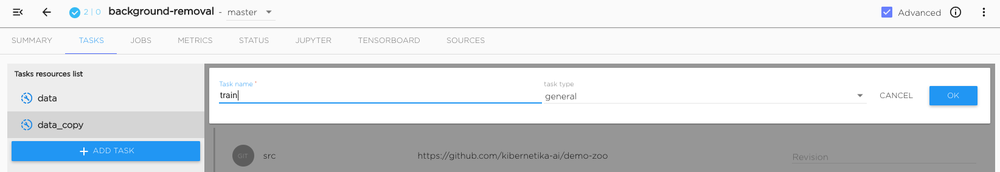

Create **export** task
  * Press “ADD TASK” and select “data_copy”
  * Change the name to “export”
  * Change the type to “export” !!!, press OK
  * Press SAVE, to save the latest step of the project
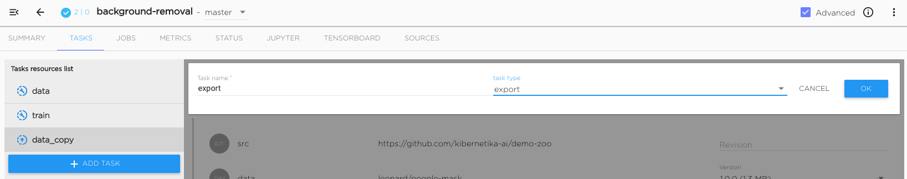

**Confiogure and execute pipeline workflow**

Configure and execute **data** task
  * In the field Task resources: Resource worker: Execution command - put the command line.

    `LIMIT_PIC=-1 jupyter nbconvert ./models/fastbg/DataSet.ipynb --execute --to html --stdout --ExecutePreprocessor.timeout=-1 | python ./submit_result.py`

    LIMIT_PIC=-1 - all pictures from the dataset will be processed (maximum)
    LIMIT_PIC=15 will limit the number of pictures to 15
    See DataSet notebook for details of the execution parameters

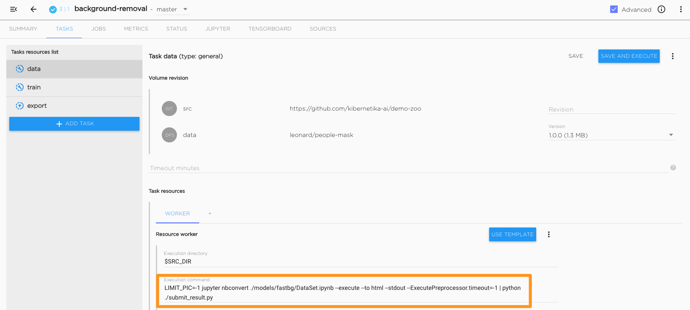


  * Press “SAVE AND EXECUTE”
 
    JOBS tab will automatically open showing the job data:1 executing
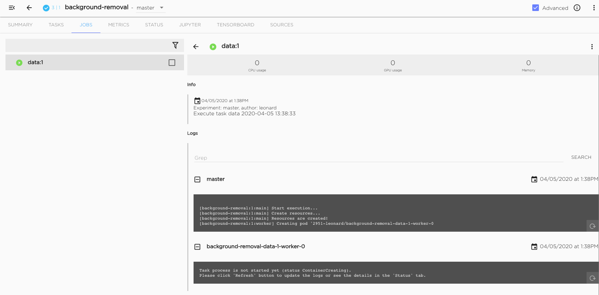
    Job will be completed when the icon will become blue
    Processing LIMIT_PIC=-1 may take several hours.
    After job is done **people-mask** dataset in the catalog will display version **1.0.1**
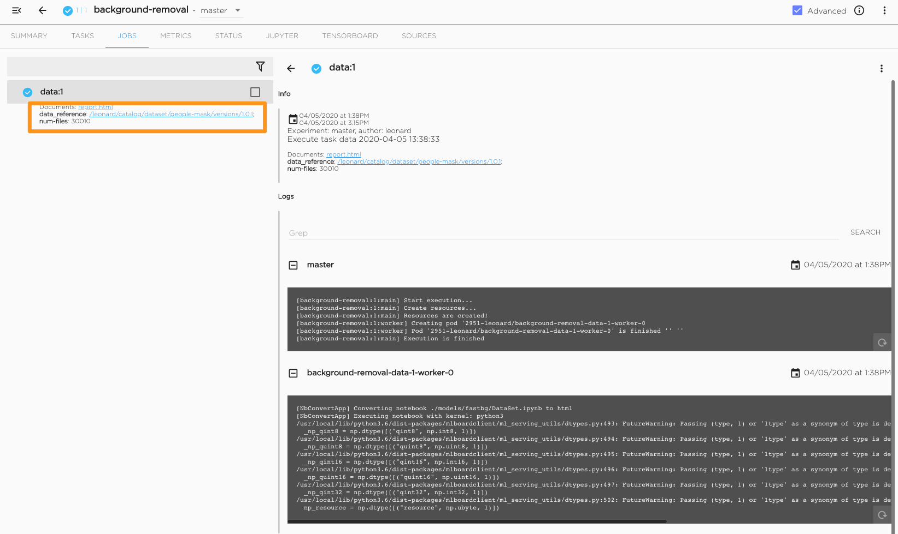


 Configure and execute **train** task

  * Go back to the TASKS tab and select task train
  * Update data volume by selecting version 1.0.1 of the dataset
  * Type Execution command.

    `python train_bg.py --worker --batch-size 8 --data_set $DATA_DIR --loss image --optimizer AdamOptimizer --num-chans 64 --lr-step-size 40 --drop-prob 0.1 --resolution 160 --num-epochs 10 --log_step_count_steps 50 --save_summary_steps 50`

  * In the Resources section put GPU=1
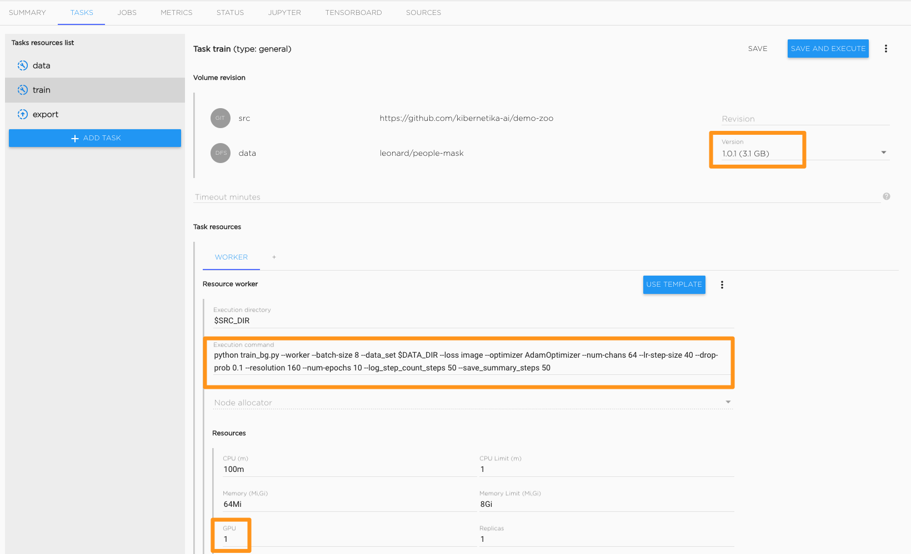

  * Press “SAVE AND EXECUTE”
    **It may take up to five minutes to bring up GPU instance for processing. You can check on the progress by the opening STATUS tab.**
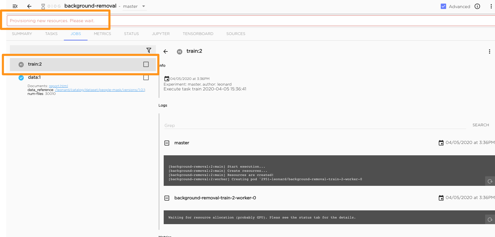


Configure task “export”
  * Go back to TASKS tab and select export
  * Change Execution command to:

    
    `python train_bg.py --export --data_set None`
    

  * Press SAVE

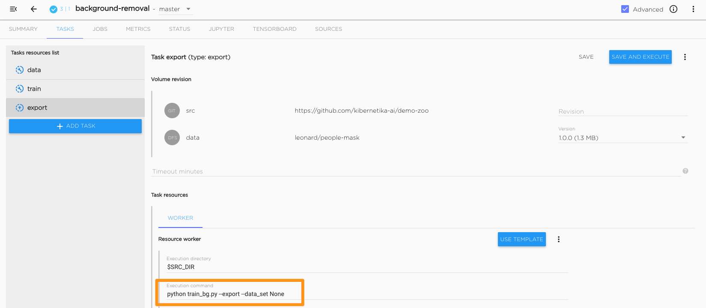

Export the trained model 
* Check the status of the “train” task. It may take several hours to complete training on the full dataset
* From the JOBS tab, select completed trained job train:2
* In the command menu select Export:export
    It will start export:3 job
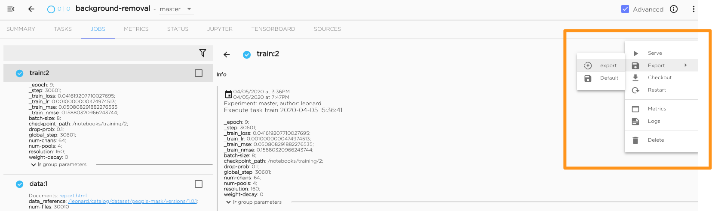

* When completed it will display two links: one model_path to the model in the project training volume, and another model_reference to the workspace catalog model person_mask
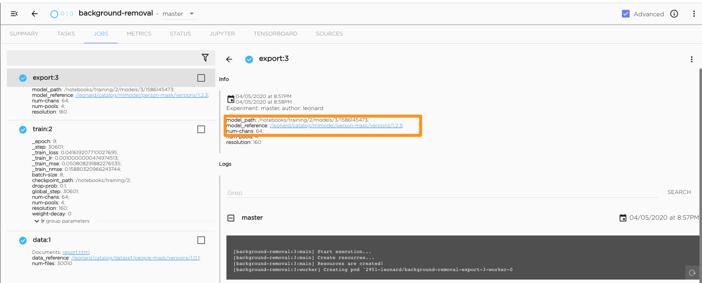


* Click on the link and the model page in the catalog will open
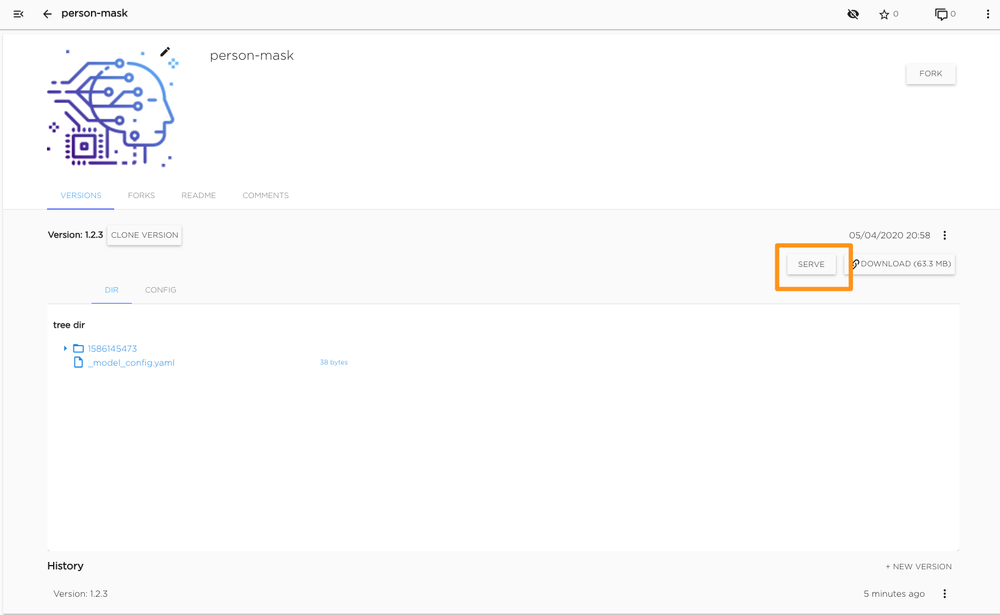

* Serve the trained model
* From the model page in the catalog press the SERVE button. You will be presented with Serving configuration form
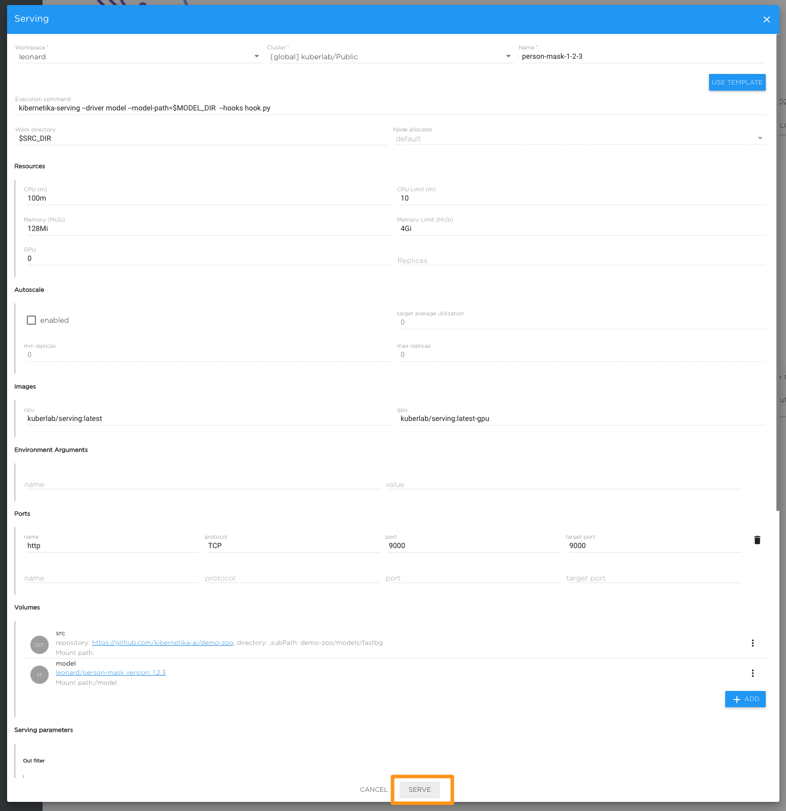

* Select the cluster you want your model to run on.
* Press SERVE at the bottom of the form

#### Explore the Results

When Serving task is up running you can test the model by loading images and processing them
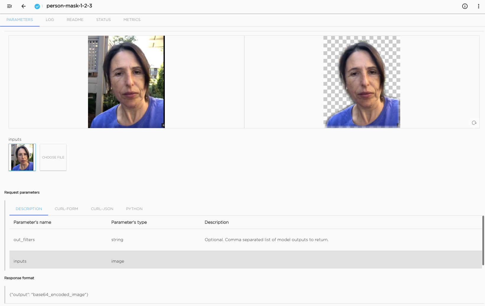

