This tutorial is a walk through an end-to-end AI project creating a face detection and recognition application in **Kibernetika**. We will begin by selecting data sets creating a project and selecting models, setting up the infrastructure, training those models, and completing by re-training for future proofing. 

Before we begin, let’s first address that there are two main steps to this project - face detection and face recognition. First, to detect that A face actually exists in the image and, second, to then recognize a specific face. Face detection includes Pnet, Rnet, and ONet neural nets to define face boundary boxes on a picture.

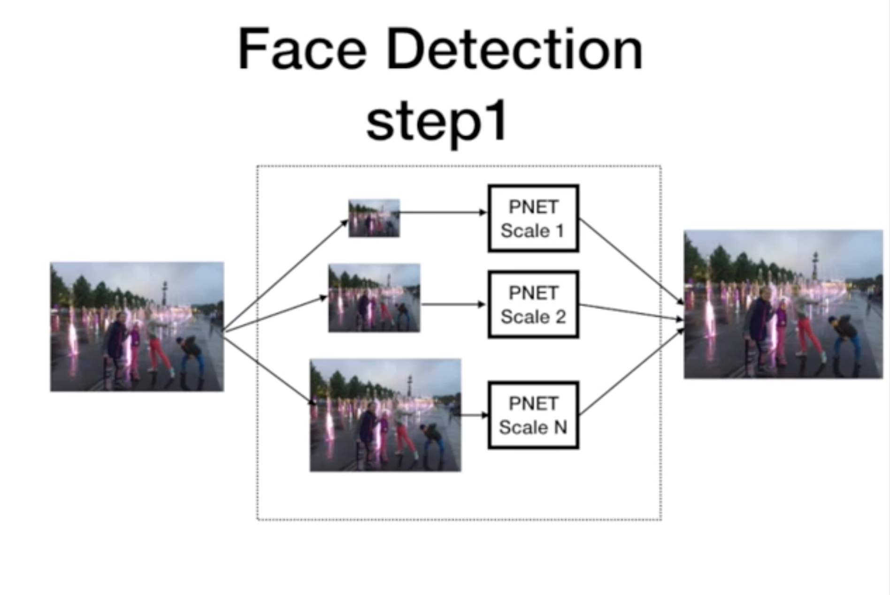

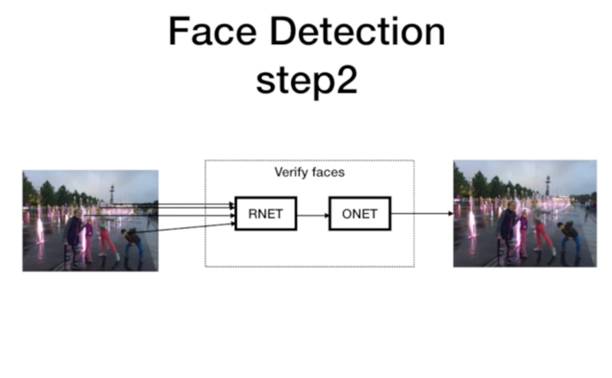

Face recognition includes calculating face embeddings using Inception ResNet model and training SVM classifier.

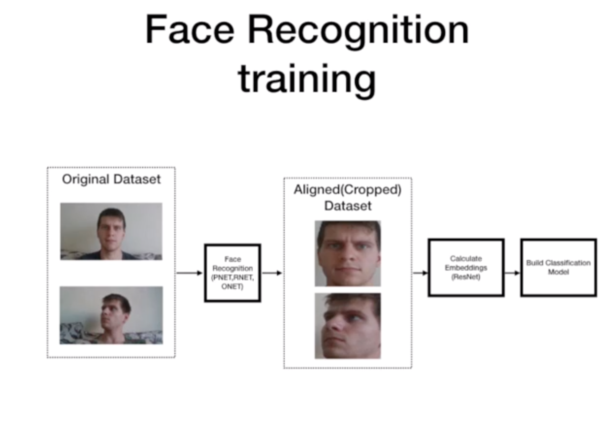

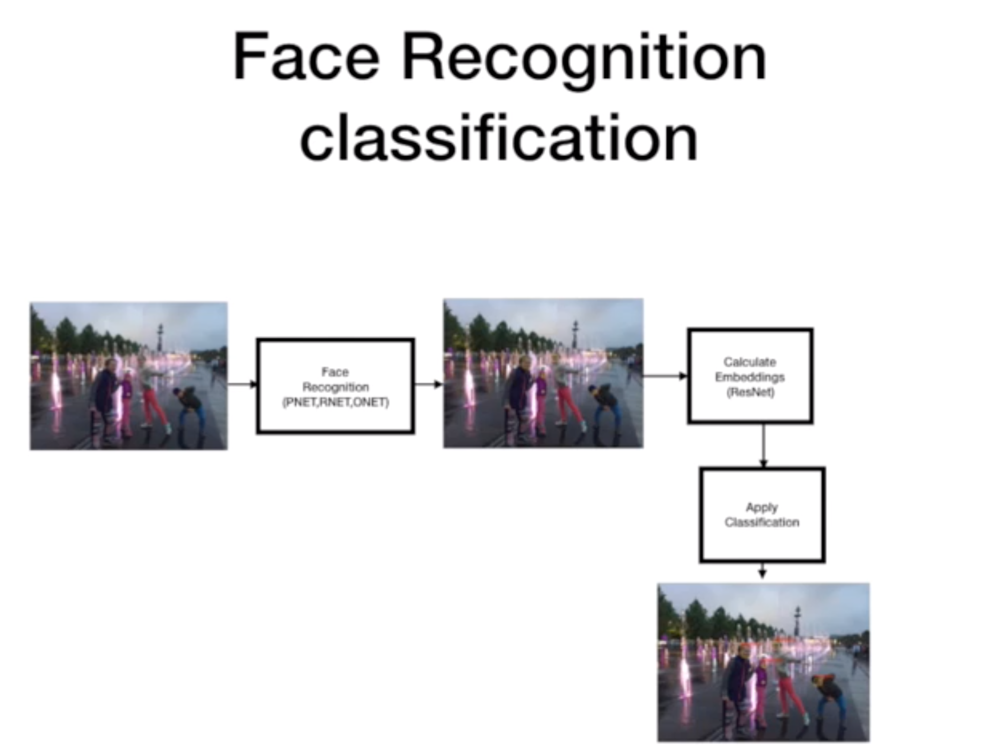

### Prepare DataSet for training

Start by creating a new dataset. In Kibernetika platform, we can do this using Web UI, CLI client or provided API. We will use Web UI.

* Open our demo dataset https://cloud.kuberlab.io/openvino-demo/catalog/dataset/open-faces/versions/1.0.0
* And **FORK** this dataset to one of your workspace

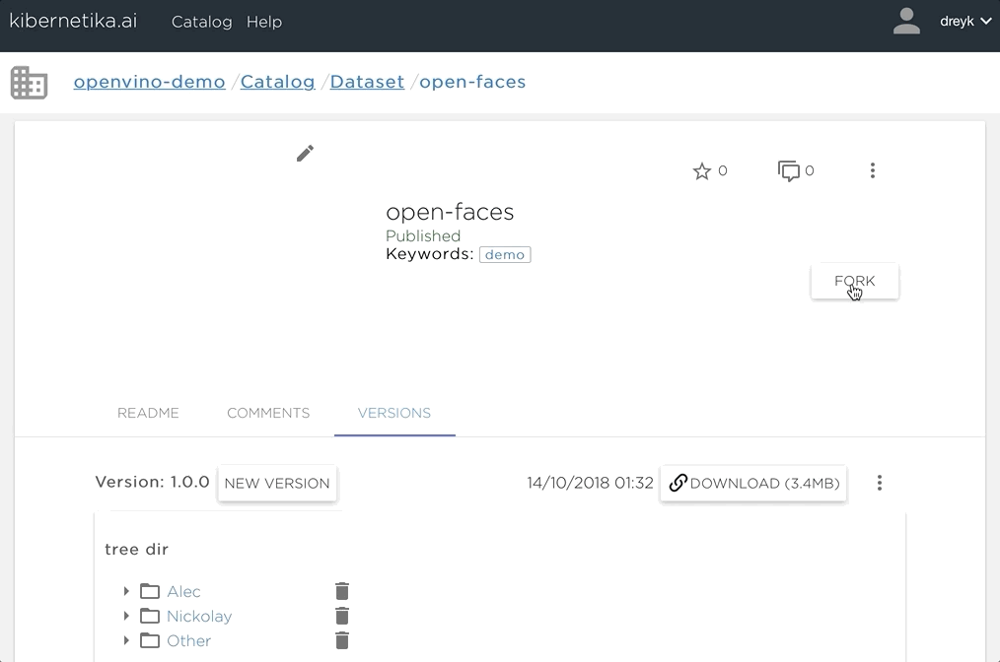

### Create Project

Once we have this data set, we can go ahead and create a project. 

* Open pre defined project template https://cloud.kuberlab.io/kuberlab-demo/catalog/chart-mlapp-v2/openvino-facenet/readme/
* And install it to your workspace

> __ATTENTION: You MUST switch dataset during installation to your personal datasets that we created on the previous step!!! It is very important this project want work with datasets form other workspaces!!!__

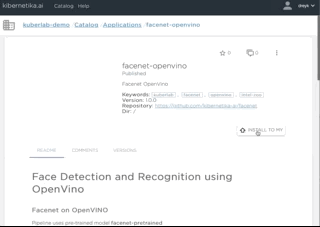

The project is now available to use.

### Convert Tensorflow model to OpenVino format

> NOTES: you can skip this step because our facenet model from catalog already has model in OpenVino format too.

To Convert project to OpenVino format we are going to execute our first task __model-converter__

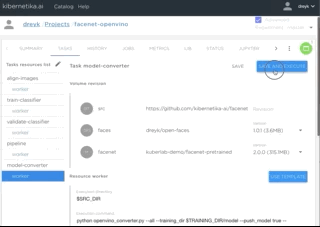

Once model is converted the new model files now existing in the your personal model catalog.

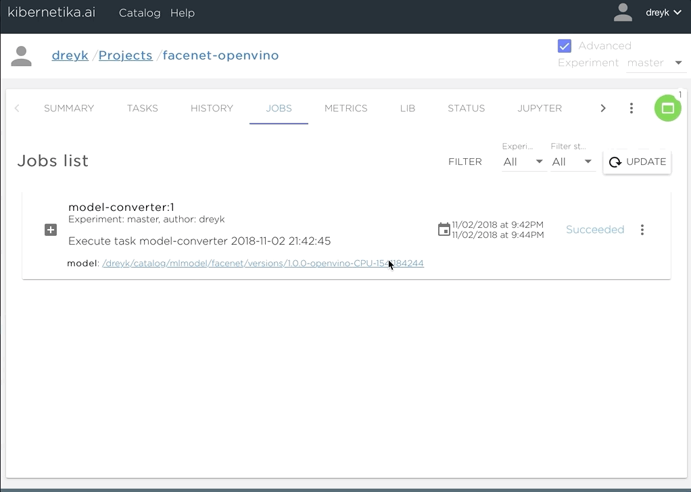

From here, we will switch over to use the generated openvino model. 

* Open __SOURCES__ of your project and switch __facenet__ source to new created model

>__NOTES:__ make sure that you choose new created model from your current workspace.

### Build face recognition model

This brings us to the next part of the project, when we can actually start to train the face recognition model. This includes 3 sub tasks that we cluster together into pipeline task - Align images, train SVM model, and validate results.

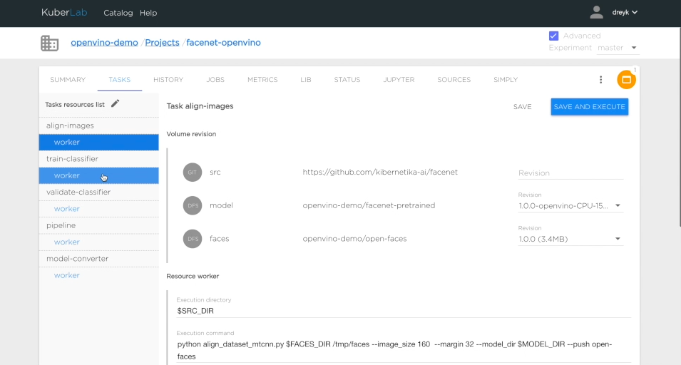

Align performs cropping and will create a new version of the dataset that contains only cropped images.

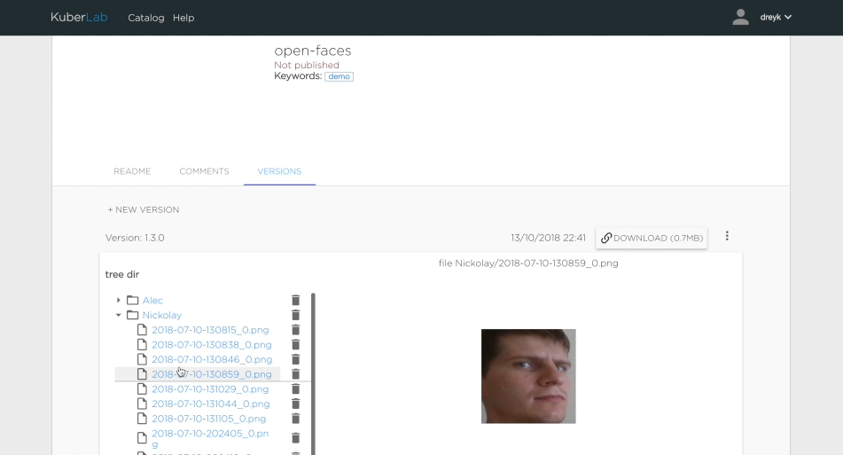

The next task is to train SVM classifier using  Inception ResNet and openvino inference engine.

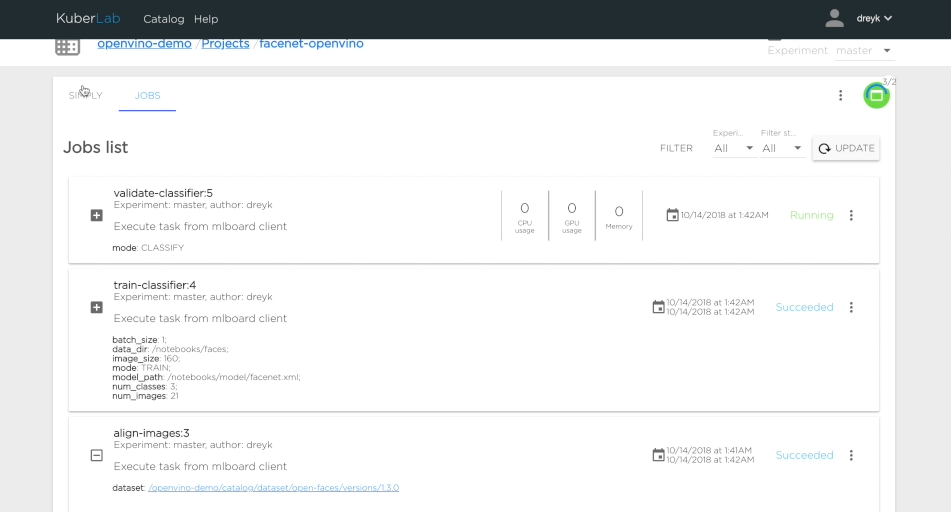

And the last task is validating the result and uploading the new model to model catalog. At this time, we generate a confusion matrix (confusion matrix keras) after the model validation to understand how accurate our new model is. 

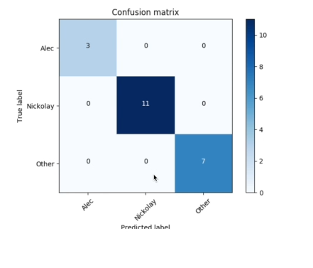

### Start Serving

After the model is built, we can start the inference portion of this project. 

* Open __JOBS__ tab of your project
* Choose last __pipeline__ finished task and press start ___serv___ from context menu
* Leave all parameters as is
* Press start __SERV__

Now you can simple test your model

### Retrain Model
Since data is likely to change over time in the real world, we can easily extend out the original dataset and continuously retrain the model. We call this Continuous Production and is a core funcion of the Kibernetika platform. Simply set up a new version, 1.0.1, add another person, Alex, and some images for that person. Reopen the project, switch the dataset to the new version and rebuild the model.

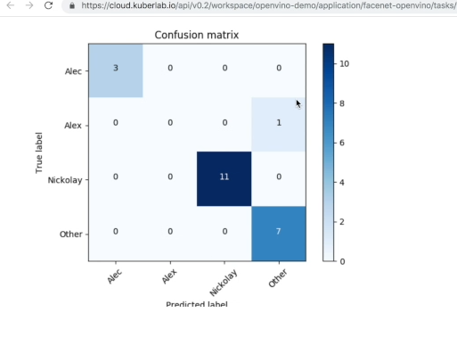

Again, once re-training and validation completed, you can see the model accuracy and then make informed decisions about deploying the new model to production. 

And, as a collaborative platform, you can easily share results, models, data, etc. with team members for a seamless rollout.

For more information on how you can accelerate your AI project with **Kibernetika**, reach us at info@kibernetika.ai today! 

