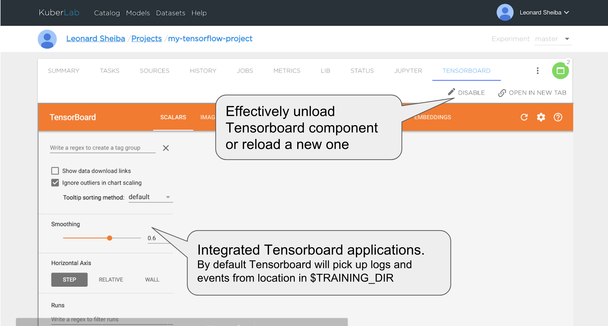
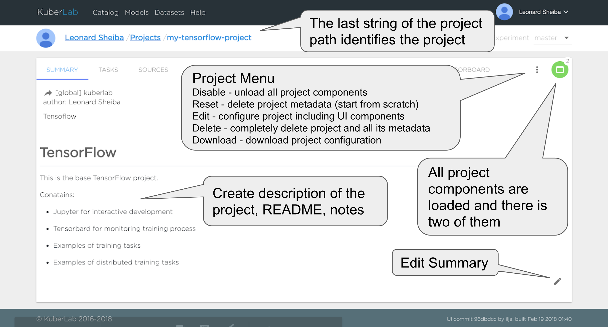
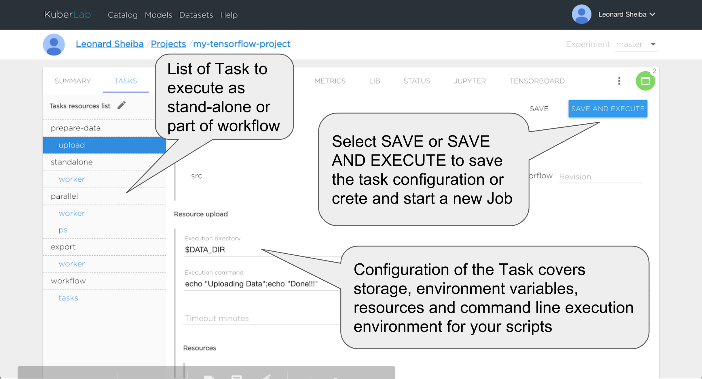
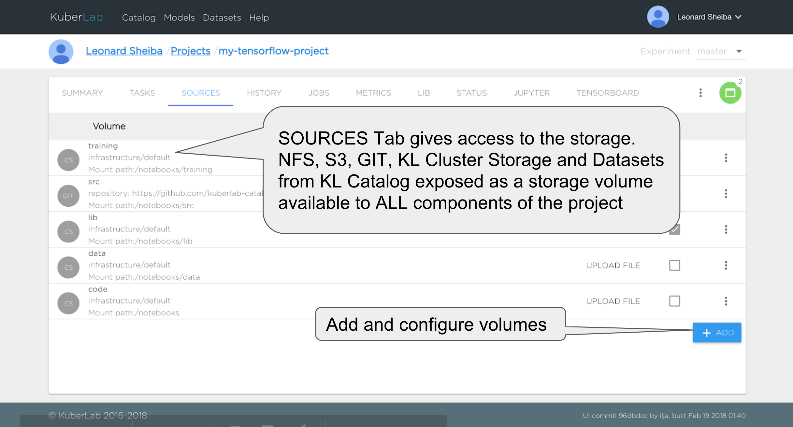
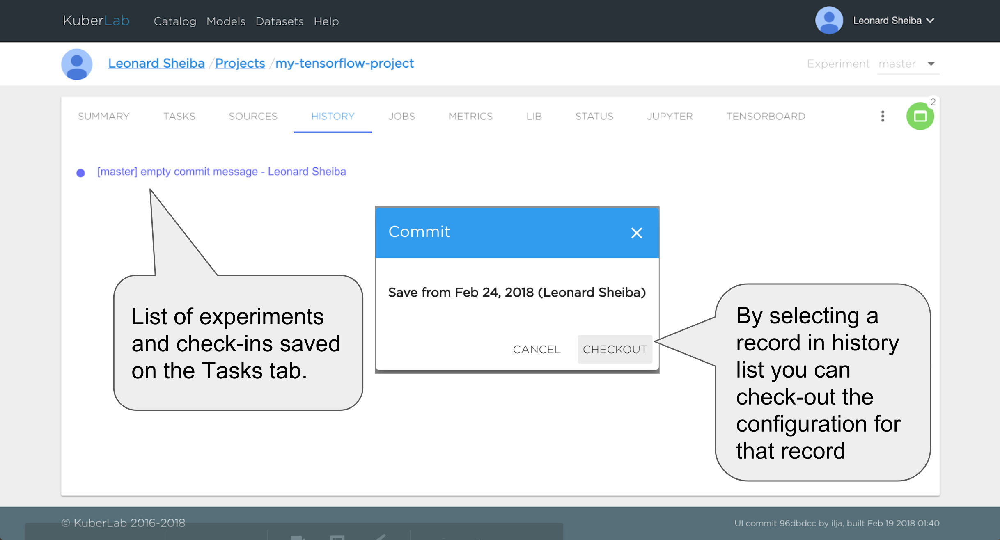
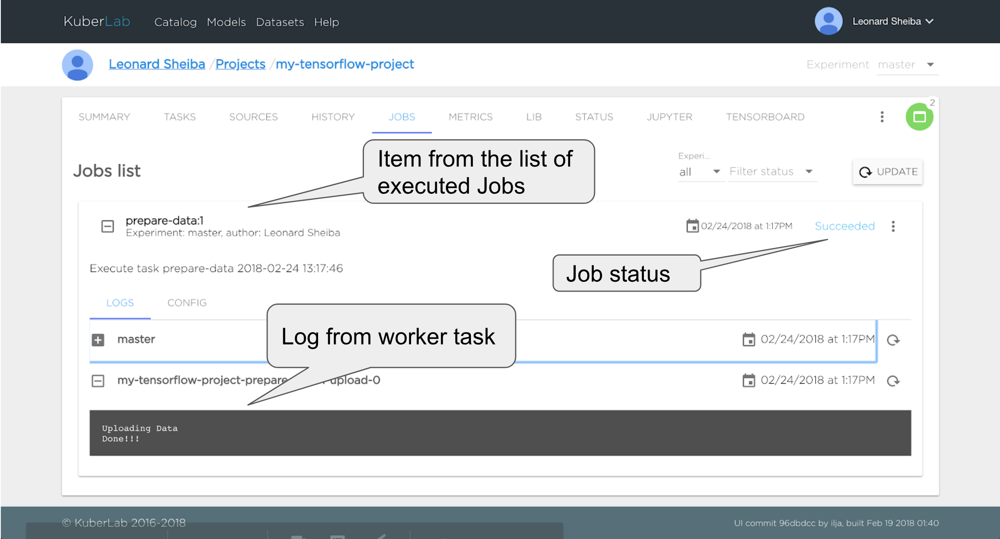
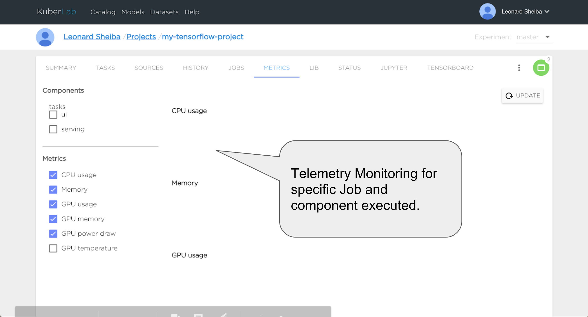
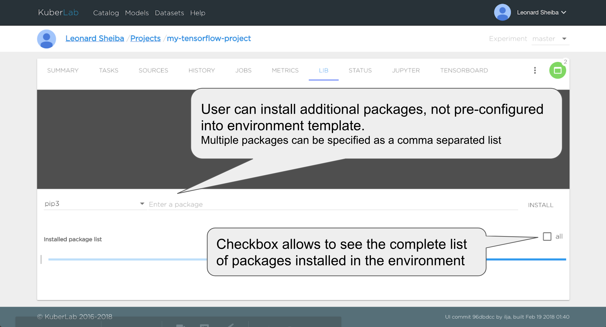

####Summary 

1. The last string of the project path identifies the project.
2. Switch view advanced / simply 
3. Select experement.
4. Project menu. 
    * Disable - unload all project components. 
    * Reset - delete project metadata (start from scratch)
    * Edit - configure project including UI components.
    * Delete - complelely delete project and all it`s metadata.
    * Download - download project configuration.
5. All project componentsare loaded and there is two of them.
6. Create descriptionof then project, README, notes.
7. Edit Summary.

####Taks 

1. List of Task to execute as stand-alone or part of workflow.
2. Edit task list.
3. Select SAVE or SAVE AND EXECUTE to save this task configuration or create and start a new Job
4. Load task template.
5. Volume revision.
6. Configuration of the Task covers storage, environment variables, resources and command line execution environment for your scripts.

####Sources 

1. Tab gives access to the storage. NFS, S3, GIT, KL Cluster Storage, Model and Dataset from KL Catalog exposed as a storage volume available to All components of then project.
2. Add and configure volumes

####History 

1. List of experiments and check-ins seved on the Tasks tab.
2. Open dialog check-out version.
3. By selectinga record in history list you can check-out the configuration for that record

####Jobs 

1. Item from the list of executed Jobs.
2. Job status.
3. Log from worker task.

####Metrics 

1. Selector to monitoring tasks, ui components or serving.
2. Selector metrics.
3. Telemetry Monitoring for specific Job and component executed.

####Lib 

1. Manager package selector. 
2. User can install additional packages, not pre-configured into evironment template. Multiple packages can be specified as a comma separated list. 
3. Chackbox allows to see the complete list of packages installed in the environment.

####Status

Tab displays the status of components of the project. Jupyter, Tensorbord, Serving and Worker components for batch operations. If for some reason KL was not able to load specific component, the diagnostic messages will be provided.

####Jupyter

1. Jupyter Notebook UI interface to the project.
2. Select node allocator.
3. Use GPU Jupyter componet.
4. Effectively unload Jupyter componet or reload a new one.

####Tensoboard

<!-- ####Summary  -->
<!--  -->

<!-- ####Taks  -->
<!--  -->

<!-- ####Sources  -->
<!--  -->

<!-- ####History  -->
<!--  -->

<!-- ####Jobs  -->
<!--  -->

<!-- ####Metrics  -->
<!--  -->

<!-- ####Lib  -->
<!--  -->

<!-- ####Status -->
<!--  -->

 <!-- ####Jupyter -->
 <!--  -->

<!-- ####Tensoboard -->
<!--  -->
