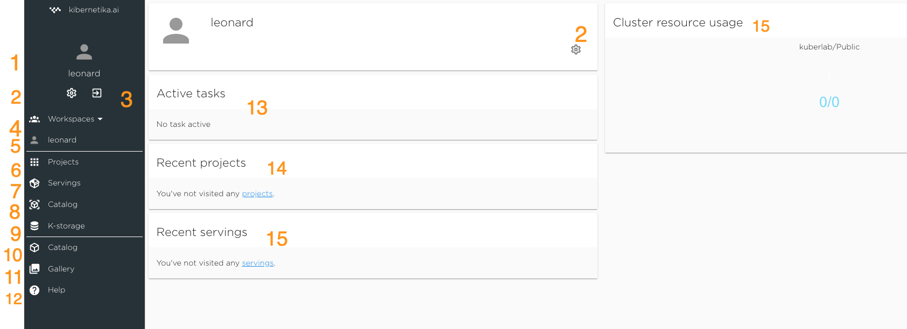
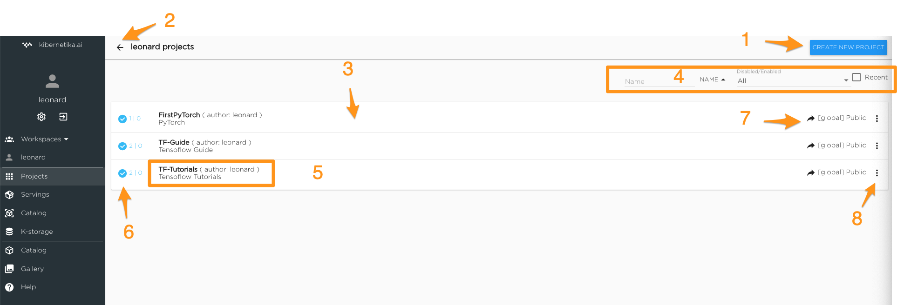
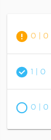
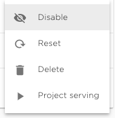
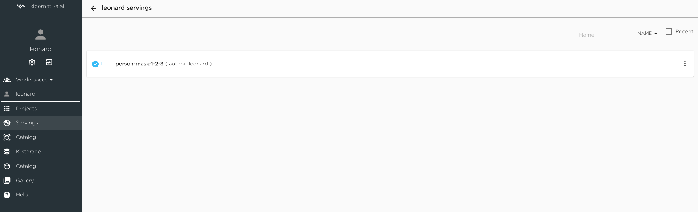
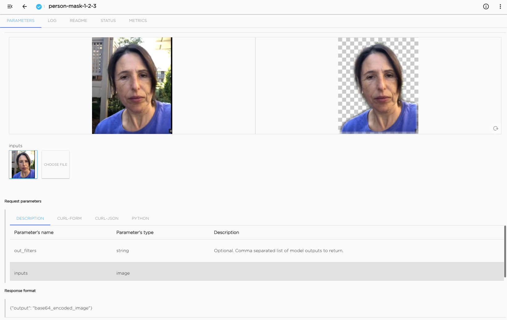

#### Workspace Home

1. User Name
2. Settings - link to the account and organisation settings page
3. Log Out
4. Workspace Selector - select from the list of available workspaces
5. Workspace Name - current workspace
6. Projects -  link to the page from with list of projects in the workspace and ability to manage existing projects and create a new one.
7. Servings - link to the page with list of servings and management functionality
8. Workspace Catalog - catalog private to the current workspace. User can save there proivate datasets and models and run serving and edge deployment.
9. K-Storage - Claster storage allocated to the workspace.
10. Kibernetika Catalog - public catalog available to every Kibernetika.AI user. It will contain application templates, tutorials, guides, some opensource datasets and pretrained models.
11. Kibernetika Demo Gallery 
12. Help - Kibernetika.AI online documentation
13. List of running tasks - dashboard showing the list of active tasks for the current workspace.
14. Recent Projects - open the list of the latest run projects
15. Recent Servings - open the list of the most recent servings
16. Resource usage - shows the availability and usage of GPU resource. In the cloud environment GPU is available on demand.

#### Workspace Projects

1. Create new project
2. Back to Workspace Home
3. List of projects
4. Search filters
5. Project name, name of the author and project description
6. Project status indicator

- project is in transition state, some components are created or terminated 
- all project components are deployed and ready 
- project is idle and jupyter component disabled, pipline tasks and other functionality is not affected, 
in the jupyter tab click "enable"
this feature prevent forgotten jupyter generate extra charges

7. Project location specifying the cluster project is running
8. Project management menu 

- Disable project - stop all project tasks and unload project components from the cluster. Data and stait of the project will be restored when the project will be enabled. For disabled project these menu item will display "Enable"
- Reset project 
- Delete project and all data associated with it. 
- Project serving will display serving configuration form and create and deploy serving components for the project

#### Workspace Servings

Clickiing on the serving in the list you will open serving application

#### Workspace Catalog

TBD

#### Workspace K-storage

