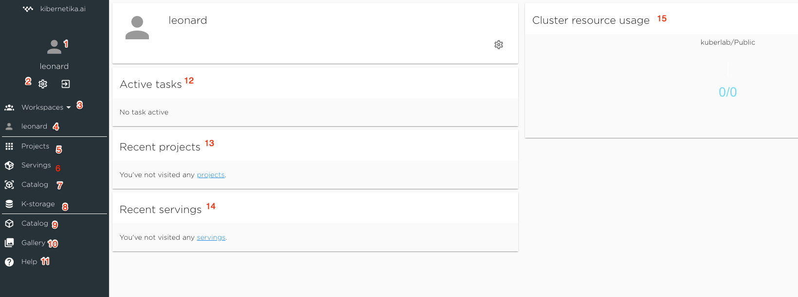

### Workspace Screen

1. User Name
2. Settings - link to the account and organisation settings page
3. Workspace Selector - select from the list of available workspaces
4. Workspace Name - current workspace
5. Projects -  link to the page from with list of projects in the workspace and ability to manage existing projects and create a new one.
6. Servings - link to the page with list of servings and management functionality
7. Workspace Catalog - catalog private to the current workspace. User can save there proivate datasets and models and run serving and edge deployment.
8. K-Storage - Claster storage allocated to the workspace.
9. Kibernetika Catalog - public catalog available to every Kibernetika.AI user. It will contain application templates, tutorials, guides, some opensource datasets and pretrained models.
10. Kibernetika Demo Gallery 
11. Help - Kibernetika.AI online documentation
12. List of running tasks - dashboard showing the list of active tasks for the current workspace.
13. Recent Projects
14. Recent Servings
15. Resource usage 